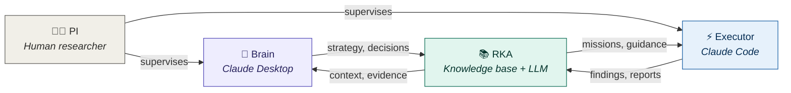
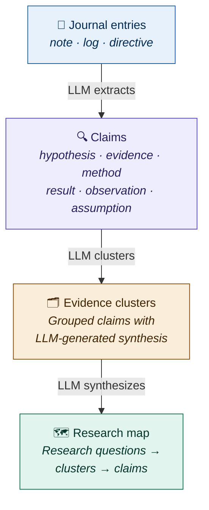
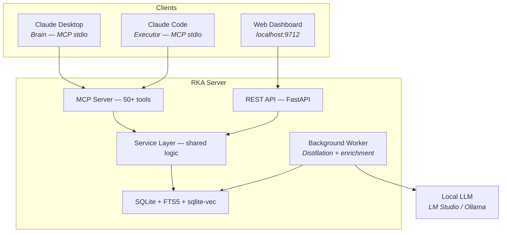
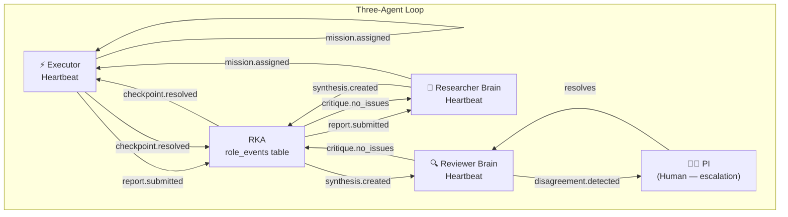

# Research Knowledge Agent (RKA)

**Persistent research memory for AI-assisted investigations.**

RKA gives your research project a brain that doesn't forget between sessions. It stores every finding, decision, hypothesis, and literature reference in a structured knowledge base — then uses a local LLM to continuously organize that knowledge into navigable evidence maps with full provenance chains.

```
 Month 1                    Month 3                    Month 6
 ┌──────────┐              ┌──────────┐              ┌──────────┐
 │ "We found │              │ "Based on │              │ "We can   │
 │  that..." │              │  3 months │              │  trace    │
 │           │   ┌─────┐   │  of evi-  │   ┌─────┐   │  every    │
 │ (lost     │──▶│ RKA │──▶│  dence..."│──▶│ RKA │──▶│  decision │
 │  next     │   └─────┘   │           │   └─────┘   │  back to  │
 │  session) │              │ (all here)│              │  its why" │
 └──────────┘              └──────────┘              └──────────┘
  Without RKA               With RKA                  With RKA v2
  Findings vanish            Everything persists        Knowledge self-organizes
```

Built for CS/IoT/CPS security research at UNC Charlotte.

---

## How it works

Three actors collaborate through a shared knowledge base:



- **Brain** (Claude Desktop) — strategic layer. Interprets findings, decides research direction, reviews evidence clusters, resolves contradictions.
- **Executor** (Claude Code) — implementation layer. Runs experiments, writes code, collects data. Receives missions, submits reports, raises checkpoints when blocked.
- **PI** (human researcher) — supervises both, resolves escalations, provides domain expertise.
- **RKA** — the shared memory. Stores everything, organizes it automatically, provides context to whoever needs it.

---

## The knowledge pipeline

Raw observations don't stay raw. RKA's background worker continuously distills journal entries into structured knowledge:



Every claim links back to its source entry with character offsets. Every cluster links to its constituent claims. The full provenance chain is always traversable.

---

## The provenance chain

Every entity in RKA knows why it exists. Typed cross-references form a complete reasoning chain:

```mermaid
graph LR
    Lit["📄 Literature<br/><i>MQTT benchmarks</i>"]
    Dec1["🔀 Decision<br/><i>Test broker limits</i>"]
    Mis["📋 Mission<br/><i>Stress test at scale</i>"]
    Entry["📝 Finding<br/><i>12% packet loss</i>"]
    Claim["💡 Claim<br/><i>Threshold at 400</i>"]
    Dec2["🔀 Decision<br/><i>Implement sharding</i>"]

    Lit -->|informed| Dec1
    Dec1 -->|motivated| Mis
    Mis -->|produced| Entry
    Entry -->|derived| Claim
    Claim -->|justified| Dec2

    style Lit fill:#F1EFE8,stroke:#5F5E5A,color:#2C2C2A
    style Dec1 fill:#EEEDFE,stroke:#534AB7,color:#26215C
    style Mis fill:#E6F1FB,stroke:#185FA5,color:#042C53
    style Entry fill:#E1F5EE,stroke:#0F6E56,color:#04342C
    style Claim fill:#FAEEDA,stroke:#854F0B,color:#412402
    style Dec2 fill:#EEEDFE,stroke:#534AB7,color:#26215C
```



12 typed link types: `informed_by` · `justified_by` · `motivated` · `produced` · `cites` · `references` · `supports` · `contradicts` · `supersedes` · `resolved_as` · `derived_from` · `builds_on`

---

## What you can do with RKA

**Record and organize:**

```
Brain:    rka_add_note("12% packet loss above 400 connections", type="note")
          rka_add_decision("Use horizontal sharding", related_journal=["jrn_..."])
          rka_create_mission("Test sharding", motivated_by_decision="dec_...")

Executor: rka_add_note("Ran 500-connection stress test", type="log")
          rka_submit_report(mission_id, findings="Sharding reduced loss to 2%")
          rka_submit_checkpoint("Need PI input on replication factor")
```

**Navigate and search:**

```
rka_get_research_map()         → Three-level view: RQs → clusters → claims
rka_trace_provenance(id)       → Literature → decision → mission → finding → claim
rka_get_review_queue()         → Items flagged for Brain's deep reasoning
rka_search("MQTT scalability") → Entries, decisions, literature, claims
rka_get_context(topic="...")   → Token-budgeted context package
```

---

## Key features

| Category | What it does |
|----------|-------------|
| **Persistent memory** | Journal entries, decisions, literature, missions, checkpoints — all survive between sessions |
| **Progressive distillation** | Background LLM pipeline: entries → claims → evidence clusters → research themes |
| **Three-layer research map** | Navigate: research questions → evidence clusters → individual claims |
| **Full provenance** | 12 typed cross-reference edges forming traceable reasoning chains |
| **Brain-augmented enrichment** | Local LLM handles routine work; review queue flags items for Brain's deep reasoning |
| **Decision lifecycle** | Overturn decisions with `rka_supersede_decision` — affected knowledge re-distills automatically |
| **Hybrid search** | FTS5 keyword + sqlite-vec embeddings + reciprocal rank fusion |
| **Multi-project** | Isolated project databases with MCP tools for switching |
| **Web dashboard** | 13-page React UI: research map, decision tree, knowledge graph, journal, timeline, orchestration panel |
| **Onboarding** | `rka_generate_claude_md` auto-generates project-specific CLAUDE.md from live DB state |
| **v2.1 Three-Agent Loop** | Executor → Researcher → Reviewer heartbeat loop runs autonomously with PI oversight |
| **PI Control Plane** | Autonomy modes, circuit breaker, cost tracking, PI overrides, stuck-event detection |
| **Literature MCP** | ArXiv, Semantic Scholar, OpenAlex, Google Scholar search via `research-tools` MCP |

---

## Table of Contents

- [Architecture](#architecture)
- [Key Concepts](#key-concepts)
- [Installation](#installation)
- [Quick Start](#quick-start)
- [Multi-Project Support](#multi-project-support)
- [CLI Reference](#cli-reference)
- [Configuration](#configuration)
- [MCP Tools Reference](#mcp-tools-reference)
- [REST API Reference](#rest-api-reference)
- [Web Dashboard](#web-dashboard)
- [Data Model](#data-model)
- [Search and Context Engine](#search-and-context-engine)
- [LLM Integration](#llm-integration)
- [Development](#development)
- [Build Phases](#build-phases)

---

## Architecture

### Brain / Executor Model

RKA implements a three-actor collaboration:



- **Brain** (Claude Desktop): Strategic decisions — what to research, which direction to take, how to interpret findings, and which review-queue items to resolve. Communicates via MCP tools.
- **Executor** (Claude Code): Implementation — runs experiments, writes code, collects data. Receives missions, submits reports, raises checkpoints.
- **PI** (Human): Oversees progress, resolves checkpoints, provides domain expertise.

### Four-Layer Design

1. **MCP Tools Layer** — Thin adapter exposing `rka_*` tools over stdio. Keeps lightweight per-session state for output compaction and digests, but no core business logic.
2. **REST API Layer** — FastAPI endpoints under `/api`. Same thin-adapter pattern, delegates to services.
3. **Service Layer** — All business logic. CRUD operations, auto-enrichment, event emission, context preparation, distillation pipeline. Shared identically by MCP and REST.
4. **Infrastructure Layer** — Database (SQLite + FTS5 + sqlite-vec), LLM gateway (LiteLLM + Instructor), embeddings (FastEmbed), file storage.

### Three-Process Model

RKA runs as three processes:

| Process | Command | Purpose | Port |
|---------|---------|---------|------|
| REST API + Web UI | `rka serve` | HTTP endpoints + static web dashboard | 9712 |
| Background Worker | started by `rka serve` | Distillation pipeline, enrichment queue, job processing | internal |
| MCP stdio server | `rka mcp` | Tool interface for Claude Desktop/Code | stdio |

The REST API and background worker share the same SQLite database file and service layer code. The background worker handles all LLM-dependent tasks (claim extraction, cluster synthesis, embedding generation, review-queue population) so that MCP and REST calls return immediately without blocking on slow LLM backends.

The MCP server communicates via stdio (stdin/stdout) and proxies all calls to the REST API at `RKA_API_URL` (default: `http://localhost:9712`).

---

## v2.1 Three-Agent Heartbeat Loop

RKA v2.1 introduces a fully autonomous three-agent research loop driven by heartbeat automation:



**Roles and subscriptions:**

| Role | Event Types it processes | Tools available |
|------|-------------------------|----------------|
| **Executor** | `mission.assigned`, `directive.*` | `rka_*` MCP tools, `research-tools` MCP (ArXiv, Scholar, etc.) |
| **Researcher Brain** | `report.submitted`, `critique.no_issues` | `rka_*` tools + literature search |
| **Reviewer Brain** | `synthesis.created`, `report.submitted` | `rka_*` tools, writes critique notes |
| **PI** | Receives `disagreement.detected` notifications | All — human judgment |

**The complete v2.1 lifecycle:**

1. PI creates a directive or Researcher creates a mission → assigned to Executor
2. Executor picks up mission via heartbeat → does work → emits `report.submitted`
3. Researcher picks up `report.submitted` → synthesizes findings → emits `synthesis.created`
4. Reviewer picks up `synthesis.created` → writes critique → emits `critique.no_issues` or `disagreement.detected`
5. On `critique.no_issues`: Researcher creates next mission → loop returns to Step 2
6. On `disagreement.detected`: PI is notified (OpenClaw session injection + WhatsApp) → PI resolves → loop continues

**Autonomy modes:** The PI can switch between `manual`, `supervised`, `autonomous`, and `paused` via the Orchestration dashboard or API. Circuit breaker and cost tracking prevent runaway spend.

**Literature research:** The Executor and Researcher have `research-tools` MCP configured, giving them live access to ArXiv, Google Scholar, Semantic Scholar, OpenAlex, and headless web browsing — enabling them to conduct real literature reviews within the loop.

---

## Key Concepts

### Entity Types

| Entity | Prefix | Purpose |
|--------|--------|---------|
| **Journal Entry** | `jrn_` | Research notes — observations, analyses, procedures, and directives |
| **Decision** | `dec_` | Decision tree nodes — questions with options, chosen path, rationale |
| **Literature** | `lit_` | Papers, articles — tracked through reading pipeline |
| **Mission** | `mis_` | Task packages assigned to the Executor with objectives and acceptance criteria |
| **Checkpoint** | `chk_` | Escalation points where Executor needs Brain/PI input |
| **Claim** | `clm_` | Extracted assertions from journal entries (hypothesis, evidence, method, result, observation, assumption) |
| **Evidence Cluster** | `ecl_` | Groups of related claims with LLM-synthesized summaries |
| **Topic** | `top_` | Hierarchical topic taxonomy for organizing knowledge |
| **Review Queue Item** | `rev_` | Items flagged for Brain review (low confidence, contradictions, missing evidence) |
| **Cross-Reference** | `link_` | Typed edges forming provenance chains between entities |
| **Event** | `evt_` | Audit trail of all state changes with causal chain links |
| **Project State** | — | Singleton per project: current phase, summary, blockers, metrics |

### Journal Entry Types

v2.0 simplifies journal entry types to three canonical categories:

| Type | Purpose |
|------|---------|
| `note` | Observations, analyses, insights — the default type for most entries |
| `log` | Procedures, methodology steps, experiment records |
| `directive` | Instructions from PI or Brain to guide future work |

Legacy types from v1 (`finding`, `insight`, `idea`, `observation`, `hypothesis`, `methodology`, `pi_instruction`, `exploration`, `summary`) are accepted as input and automatically mapped to the nearest v2.0 type.

### Progressive Distillation Pipeline

The distillation pipeline runs in the background and incrementally enriches raw journal entries into higher-level knowledge structures:

```
Journal Entries (note / log / directive)
    |
    | [background worker: claim extraction]
    v
Claims (clm_)
  hypothesis | evidence | method | result | observation | assumption
    |
    | [background worker: clustering]
    v
Evidence Clusters (ecl_)
  LLM-synthesized summary of related claims
    |
    | [background worker: research-map assembly]
    v
Research Map
  Research Questions --> Clusters --> Claims
```

Each stage is asynchronous and non-blocking. Entries immediately become searchable; distillation refines understanding over time.

### ULID-Based IDs

All entities use type-prefixed ULIDs (e.g., `dec_01HXYZ...`). ULIDs are globally unique, sortable by creation time, and the prefix makes debugging easier when reading logs or database rows.

### Mission Lifecycle

```
Brain creates mission --> Executor picks up (active) --> Work proceeds
    --> Checkpoint raised if blocked --> Brain/PI resolves
    --> Executor submits report --> Brain reviews
    --> Mission marked complete/partial/blocked
```

### Review Queue

The review queue collects items that need Brain attention: low-confidence claims, contradictions between claims, clusters needing narrative synthesis, and distillation jobs with ambiguous results. Brain can approve, reject, merge, or override each item. Resolved items feed back into the distillation pipeline.

### Decision Superseding

When a decision is superseded by new evidence, RKA marks the old decision as superseded, links it to the replacement, and optionally re-runs distillation on claims that cited the old decision. This preserves the full audit trail while keeping the active research map current.

### Provenance Chains

Every entity can be linked to its sources via typed `link_` cross-references. Common link types include `derived_from`, `contradicts`, `supports`, `supersedes`, and `cites`. These edges form the provenance graph visible in the Knowledge Graph page.

### Context Temperature

Entries are classified by recency:

| Temperature | Age | Behavior |
|-------------|-----|----------|
| **HOT** | <= 3 days | Included in full, highest priority |
| **WARM** | <= 14 days | Included, may be compressed |
| **COLD** | > 14 days | Summarized or excluded |
| **ARCHIVE** | Manually archived | Excluded unless explicitly requested |

The Context Engine uses these temperatures to build focused context packages within token budgets.

---

## Installation

### Option A: Docker (Recommended)

Prerequisites: [Docker Desktop](https://www.docker.com/products/docker-desktop/) + [LM Studio](https://lmstudio.ai/) (or Ollama)

```bash
git clone https://github.com/infinitywings/rka.git
cd rka
docker compose up -d
```

That is it. Open `http://localhost:9712` in your browser.

**Connect Claude Desktop (MCP):**

Add to `~/Library/Application Support/Claude/claude_desktop_config.json` (macOS) or `~/.config/Claude/claude_desktop_config.json` (Linux):

```json
{
  "mcpServers": {
    "rka": {
      "command": "docker",
      "args": ["exec", "-i", "rka-server", "rka", "mcp"]
    }
  }
}
```

**LLM Setup:** Start LM Studio on your host machine, load a model, and configure it from the web UI Settings page (`http://localhost:9712/settings`). The default API base is `http://localhost:1234/v1`. Context window is auto-detected.

**Connect Claude Code (MCP via pipx):**

Install the MCP binary outside Docker so Claude Code can launch it directly:

```bash
pipx install . --force
```

```json
{
  "mcpServers": {
    "rka": {
      "command": "/Users/<you>/.local/bin/rka",
      "args": ["mcp"]
    }
  }
}
```

The MCP binary is stateless — it proxies all calls to the Docker container's REST API at `RKA_API_URL`.

### Option B: From Source (Development)

Prerequisites:
- Python 3.11+
- Node.js 18+ (for web dashboard)
- [LM Studio](https://lmstudio.ai/) or [Ollama](https://ollama.com/) (for LLM features)

```bash
git clone https://github.com/infinitywings/rka.git
cd rka

# Create venv and install
python -m venv .venv
source .venv/bin/activate
pip install -e ".[llm,academic,workspace]"

# Build web UI
cd web && npm install && npm run build && cd ..

# Start the server (REST API + background worker)
rka serve
```

**Connect Claude Desktop/Code (MCP):**

```bash
# Install the MCP binary via pipx (avoids macOS sandbox issues)
pipx install . --force
```

```json
{
  "mcpServers": {
    "rka": {
      "command": "/Users/<you>/.local/bin/rka",
      "args": ["mcp"]
    }
  }
}
```

---

## Quick Start

### 1. Start the Server

```bash
# Docker (recommended)
docker compose up -d

# Or from source
rka serve
```

The web dashboard is at `http://localhost:9712`. API docs are at `http://localhost:9712/docs`.

### 2. Configure LLM

Open the **Settings** page in the web UI. Set your LLM backend:

- **LM Studio**: API Base = `http://localhost:1234/v1`, Model = select from dropdown
- **Ollama**: API Base = leave empty, Model = `ollama/qwen3:32b`

The model's context window is auto-detected. All LLM-dependent features (Q&A, summaries, smart classification, distillation pipeline) are disabled until an LLM is connected.

### 3. Connect Claude Desktop or Claude Code

Add the MCP config (see Installation above). Both Claude Desktop and Claude Code now have access to all `rka_*` tools. Use `rka_list_projects`, `rka_set_project`, and `rka_create_project` for multi-project workflows.

### 4. Try the v2.1 Demo Project (Recommended First Step)

The fastest way to see v2.1 in action is to run the demo script — it pre-populates a complete three-agent research cycle:

```bash
python scripts/v2.1_demo_project.py
```

This creates a fully populated project ("Privacy-Preserving Federated Learning for IoT Edge Devices") with:
- PI directive, literature entries, missions, executor reports, researcher synthesis notes, reviewer critiques, decisions, and checkpoints
- Events showing the complete loop: `report.submitted` → `synthesis.created` → `critique.no_issues` / `disagreement.detected`
- Autonomy mode set to `autonomous`

See `docs/v2.1_example_research_plan.md` for a detailed annotated walkthrough of the same project.

### 5. Generate Onboarding Instructions (Optional)

Run `rka_generate_claude_md` from Claude Desktop or hit `GET /api/generate-claude-md?role=executor` to generate a customized `CLAUDE.md` for the current project and role. This gives new sessions immediate context on project goals, conventions, and active work.

### 6. Start Researching

Use the web UI for browsing and Q&A, or use Claude Desktop/Code with MCP tools for the full three-agent loop. The dashboard lets you select the active project, browse the Research Map, manage the review queue, check the Orchestration panel for autonomy mode and cost tracking, and export the active project as a knowledge pack.

For end-to-end task walkthroughs, see [USAGE_GUIDE.md](USAGE_GUIDE.md) or [docs/v2.1_example_research_plan.md](docs/v2.1_example_research_plan.md).

---

## Multi-Project Support

Multi-project management is available through both MCP and REST:

- **MCP tools**: `rka_list_projects` lists all projects. `rka_set_project` switches the active project by name or ID. `rka_create_project` creates a new project without leaving the MCP session.
- **REST API and web dashboard**: Project-aware. The dashboard stores the active project locally and injects `X-RKA-Project` on API requests automatically.
- **Knowledge packs**: Export the active project with `GET /api/projects/export`. Import a previously exported pack with `POST /api/projects/import`. Import creates a separate project, remaps project-scoped entity IDs, and rewrites internal references.
- **Workspace bootstrap**: CLI bootstrap commands target the current database/default project. For project-specific bootstrap in a multi-project database, use `POST /api/workspace/scan` and `POST /api/workspace/ingest` with `X-RKA-Project`.

---

## CLI Reference

### `rka init <name>`

Initialize a new RKA workspace and seed the default project.

```bash
rka init "IoT Security Analysis" --description "Systematic review of CPS vulnerabilities"
```

| Option | Default | Description |
|--------|---------|-------------|
| `--description` | `""` | Project description |
| `--dir` | `.` | Project directory |

### `rka serve`

Start the REST API + web dashboard server and the background worker.

```bash
rka serve --port 9712 --reload
```

| Option | Default | Description |
|--------|---------|-------------|
| `--host` | `127.0.0.1` | Bind address |
| `--port` | `9712` | Port number |
| `--reload` | `false` | Auto-reload on code changes (dev mode) |

### `rka mcp`

Start the MCP stdio server for Claude Desktop or Claude Code. The MCP server is stateless — it proxies all calls to the REST API at `RKA_API_URL`.

```bash
rka mcp
```

No options — communicates via stdin/stdout per the MCP protocol.

### `rka status`

Show current project state.

```bash
rka status
```

Displays: project name, current phase, active mission, open checkpoints, entity counts.

### `rka backup`

Backup the SQLite database.

```bash
rka backup --output ./backups/rka-backup.db
```

| Option | Default | Description |
|--------|---------|-------------|
| `--output` | Timestamped file | Output path for backup |

### `rka migrate`

Run pending database migrations.

```bash
rka migrate
```

### `rka bootstrap scan <folder>`

Scan a workspace folder and classify files for ingestion into the knowledge base.

```bash
rka bootstrap scan ~/research/project_files --no-llm
```

| Option | Default | Description |
|--------|---------|-------------|
| `--ignore` | — | Additional ignore patterns (repeatable) |
| `--no-llm` | `false` | Disable LLM-enhanced classification |
| `--json-output` | `false` | Output raw JSON manifest |

### `rka bootstrap ingest <folder>`

Scan and ingest a workspace folder into the knowledge base.

```bash
rka bootstrap ingest ~/research/project_files --phase phase_1 --tags bootstrap -y
```

| Option | Default | Description |
|--------|---------|-------------|
| `--phase` | `None` | Research phase for all entries |
| `--tags` | — | Tags to add to all entries (repeatable) |
| `--skip` | — | Relative paths to skip (repeatable) |
| `--no-llm` | `false` | Disable LLM-enhanced classification |
| `--dry-run` | `false` | Preview without creating entries |
| `--yes` | `false` | Skip confirmation prompt |

These CLI bootstrap commands target the current database/default project. In a multi-project deployment, use `POST /api/workspace/scan` and `POST /api/workspace/ingest` with `X-RKA-Project` to bootstrap a specific project.

---

## Configuration

All settings use environment variables with the `RKA_` prefix. Place them in a `.env` file in your project directory.

### Core Settings

| Variable | Default | Description |
|----------|---------|-------------|
| `RKA_PROJECT_DIR` | `.` | Project root directory |
| `RKA_DB_PATH` | `rka.db` | SQLite database file path |
| `RKA_HOST` | `127.0.0.1` | API server bind address |
| `RKA_PORT` | `9712` | API server port |
| `RKA_API_URL` | `http://localhost:9712` | REST API URL for MCP proxy |

### LLM Settings

LLM configuration is managed from the **web UI Settings page**. Changes persist in the database and survive restarts without touching `.env`. Environment variables serve as initial defaults.

| Variable | Default | Description |
|----------|---------|-------------|
| `RKA_LLM_ENABLED` | `true` | Enable LLM features |
| `RKA_LLM_MODEL` | `openai/qwen3-32b` | LiteLLM model identifier (`openai/*` for LM Studio, `ollama/*` for Ollama) |
| `RKA_LLM_API_BASE` | `http://localhost:1234/v1` | LLM API base URL |
| `RKA_LLM_API_KEY` | `None` | API key (not needed for local backends) |
| `RKA_LLM_THINK` | `false` | Enable thinking/reasoning mode |
| `RKA_LLM_CONTEXT_WINDOW` | `4096` | Context window in tokens (auto-detected from LM Studio/Ollama) |

### Embedding Settings

| Variable | Default | Description |
|----------|---------|-------------|
| `RKA_EMBEDDINGS_ENABLED` | `false` | Enable embedding generation |
| `RKA_EMBEDDING_MODEL` | `nomic-ai/nomic-embed-text-v1.5` | FastEmbed model name |

### Context Engine Settings

| Variable | Default | Description |
|----------|---------|-------------|
| `RKA_CONTEXT_HOT_DAYS` | `3` | Days for HOT temperature classification |
| `RKA_CONTEXT_WARM_DAYS` | `14` | Days for WARM temperature classification |
| `RKA_CONTEXT_DEFAULT_MAX_TOKENS` | `2000` | Default token budget for context packages |

### LLM Provider Examples

**LM Studio (recommended, local):**
```env
RKA_LLM_MODEL=openai/qwen3-32b
RKA_LLM_API_BASE=http://localhost:1234/v1
```

**Ollama (local):**
```env
RKA_LLM_MODEL=ollama/qwen3:32b
# No API base needed -- LiteLLM routes to Ollama's default port
```

**OpenAI-compatible (vLLM, etc.):**
```env
RKA_LLM_MODEL=openai/your-model
RKA_LLM_API_BASE=http://localhost:8000/v1
RKA_LLM_API_KEY=token-xxx
```

> **Tip:** You can change all LLM settings at runtime from the web UI Settings page without restarting the server. The model dropdown auto-populates from your LM Studio/Ollama instance.

---

## MCP Tools Reference

All tools are prefixed with `rka_` and available through the MCP stdio interface. The MCP server is defined in `rka/mcp/server.py`.

### Project

| Tool | Purpose |
|------|---------|
| `rka_list_projects` | List all projects with name, description, and ID |
| `rka_set_project` | Switch the active project by name or ID |
| `rka_create_project` | Create a new project and optionally switch to it |
| `rka_get_status` | Get current project state (phase, summary, blockers, metrics) |
| `rka_update_status` | Update project state |

### Notes

| Tool | Purpose |
|------|---------|
| `rka_add_note` | Add a journal entry with optional tags; type is note, log, or directive (legacy types are mapped automatically) |
| `rka_update_note` | Update an existing journal entry |
| `rka_get_journal` | Query journal entries with filters (type, phase, confidence, since) |

### Decisions

| Tool | Purpose |
|------|---------|
| `rka_add_decision` | Add a decision node to the research decision tree |
| `rka_update_decision` | Update a decision (change status, record chosen option, add rationale) |
| `rka_get_decision_tree` | Get the full decision tree structure |

### Literature

| Tool | Purpose |
|------|---------|
| `rka_add_literature` | Add a literature entry (paper, article, book) |
| `rka_update_literature` | Update any literature field (title, authors, year, venue, doi, abstract, status, methodology_notes, tags, etc.) |
| `rka_get_literature` | Query literature with filters |
| `rka_enrich_doi` | Enrich a literature entry by looking up its DOI via CrossRef |

### Missions

| Tool | Purpose |
|------|---------|
| `rka_create_mission` | Create a mission for the Executor with objectives, tasks, and acceptance criteria |
| `rka_get_mission` | Get a mission by ID, or the current active mission |
| `rka_update_mission_status` | Update mission status and task progress |
| `rka_submit_report` | Submit an execution report for a completed/partial mission |
| `rka_get_report` | Retrieve a mission report |

### Checkpoints (Escalation)

| Tool | Purpose |
|------|---------|
| `rka_submit_checkpoint` | Raise a decision/clarification/inspection checkpoint |
| `rka_get_checkpoints` | List checkpoints by status (open, resolved, dismissed) |
| `rka_resolve_checkpoint` | Resolve a checkpoint with a decision and rationale |

### Research Map (v2.0)

| Tool | Purpose |
|------|---------|
| `rka_get_research_map` | Get the three-level research map: research questions, evidence clusters, and claims |
| `rka_get_claims` | Query extracted claims with filters (type, confidence, cluster, entry_id) |
| `rka_supersede_decision` | Mark a decision as superseded by a new decision, with optional re-distillation of affected claims |
| `rka_trace_provenance` | Trace the full provenance chain for an entity — all upstream sources and downstream derivatives |

### Review Queue (v2.0)

| Tool | Purpose |
|------|---------|
| `rka_get_review_queue` | List items in the review queue (low confidence, contradictions, synthesis needed) |
| `rka_review_cluster` | Review and approve or revise an evidence cluster's synthesized summary |
| `rka_review_claims` | Review a set of claims — accept, reject, merge, or flag for further investigation |
| `rka_resolve_contradiction` | Resolve a contradiction between two claims with a rationale and disposition |

### Search and Context

| Tool | Purpose |
|------|---------|
| `rka_search` | Hybrid search across all entity types |
| `rka_get_context` | Generate a focused context package for a topic within a token budget |
| `rka_ask` | Ask a question grounded in the knowledge base (RAG) |
| `rka_summarize` | On-demand topic summarization |
| `rka_eviction_sweep` | Propose entries for archival based on staleness |

### Graph

| Tool | Purpose |
|------|---------|
| `rka_get_graph` | Get the full entity relationship graph |
| `rka_get_ego_graph` | Get the ego graph centered on a specific entity |
| `rka_graph_stats` | Get graph statistics (node counts, edge counts, density) |

### Orchestration (v2.1)

| Tool | Purpose |
|------|---------|
| `rka_get_orchestration_status` | Full dashboard: autonomy mode, circuit breaker state, cost summary, role costs, stuck events |
| `rka_set_autonomy_mode` | Set mode to `manual`, `supervised`, `autonomous`, or `paused` |
| `rka_emit_event` | Emit a named event for the three-agent loop (e.g. `synthesis.created`, `critique.no_issues`, `disagreement.detected`) |
| `rka_pi_override` | Inject a priority directive with elevated urgency, bypassing normal event routing |
| `rka_log_cost` | Record a cost entry for token tracking |
| `rka_get_cost_summary` | Aggregate token cost by time window, with per-role breakdown |
| `rka_reset_circuit_breaker` | Reset the circuit breaker (PI only) |
| `rka_retry_stuck_event` | Retry a stuck event that failed to fan out to subscribers |

### Academic Import and Enrichment

| Tool | Purpose |
|------|---------|
| `rka_search_semantic_scholar` | Search Semantic Scholar for papers by query, with optional year/field filters and auto-add to library |
| `rka_search_arxiv` | Search arXiv for papers by query, with sort options and optional auto-add to library |
| `rka_browse_url` | Headless browser fetch of any URL (arXiv abstracts, GitHub READMEs, paper pages) |
| `rka_search_elicit` | Search Elicit for papers relevant to a research question |
| `rka_import_bibtex` | Import literature entries from a BibTeX string (auto-detects duplicates by DOI and title) |

### Workspace Bootstrap

| Tool | Purpose |
|------|---------|
| `rka_scan_workspace` | Scan a folder and classify files for ingestion (regex heuristics + optional LLM enhancement) |
| `rka_bootstrap_workspace` | One-shot scan + ingest: classify and import all files into the knowledge base |
| `rka_review_bootstrap` | Review a completed bootstrap — entry counts, suggestions, and narrative for Brain handoff |

### Session

| Tool | Purpose |
|------|---------|
| `rka_session_digest` | Generate a digest of the current session's activity for handoff |
| `rka_reset_session` | Reset per-session state (compaction counters, digest buffer) |

### Onboarding (v2.0)

| Tool | Purpose |
|------|---------|
| `rka_generate_claude_md` | Generate a customized CLAUDE.md for the active project and role (executor, brain) |

### Export

| Tool | Purpose |
|------|---------|
| `rka_export` | Export research data as markdown, JSON, or Mermaid diagram (scopes: state, decisions, literature, full) |
| `rka_export_mermaid` | Export the decision tree as a Mermaid flowchart with status-based styling |

### Enrichment

| Tool | Purpose |
|------|---------|
| `rka_enrich` | Trigger or check background enrichment jobs for one or more entities |

---

## REST API Reference

Base URL: `http://localhost:9712/api`

Interactive API docs available at `http://localhost:9712/docs` (Swagger UI).

Most entity endpoints are project-scoped. Pass `X-RKA-Project: <project_id>` to target a specific project. If omitted, the server falls back to `proj_default`.

### Notes (Journal Entries)

| Method | Endpoint | Description |
|--------|----------|-------------|
| `POST` | `/notes` | Create a journal entry |
| `GET` | `/notes` | List entries (filters: type, phase, confidence, importance, source, since, hide_superseded) |
| `GET` | `/notes/{id}` | Get a single entry |
| `PUT` | `/notes/{id}` | Update an entry |

### Decisions

| Method | Endpoint | Description |
|--------|----------|-------------|
| `POST` | `/decisions` | Create a decision node |
| `GET` | `/decisions` | List decisions (filters: phase, status, parent_id) |
| `GET` | `/decisions/tree` | Get the full tree structure (for visualization) |
| `GET` | `/decisions/{id}` | Get a single decision with options |
| `PUT` | `/decisions/{id}` | Update a decision |
| `POST` | `/decisions/{id}/supersede` | Supersede a decision with a replacement, optionally triggering re-distillation |

### Literature

| Method | Endpoint | Description |
|--------|----------|-------------|
| `POST` | `/literature` | Add a literature entry |
| `GET` | `/literature` | List entries (filters: status, year range, venue, query) |
| `GET` | `/literature/{id}` | Get a single entry |
| `PUT` | `/literature/{id}` | Update an entry |

### Missions

| Method | Endpoint | Description |
|--------|----------|-------------|
| `POST` | `/missions` | Create a mission |
| `GET` | `/missions` | List missions (filters: phase, status) |
| `GET` | `/missions/{id}` | Get a single mission |
| `PUT` | `/missions/{id}` | Update a mission |
| `POST` | `/missions/{id}/report` | Submit an execution report |
| `GET` | `/missions/{id}/report` | Get the mission report |

### Checkpoints

| Method | Endpoint | Description |
|--------|----------|-------------|
| `POST` | `/checkpoints` | Create a checkpoint |
| `GET` | `/checkpoints` | List checkpoints (filters: status, mission_id) |
| `GET` | `/checkpoints/{id}` | Get a single checkpoint |
| `PUT` | `/checkpoints/{id}/resolve` | Resolve a checkpoint |

### Claims (v2.0)

| Method | Endpoint | Description |
|--------|----------|-------------|
| `POST` | `/claims` | Create a claim manually or trigger extraction from a journal entry |
| `GET` | `/claims` | List claims (filters: type, confidence, cluster_id, entry_id) |
| `GET` | `/claims/{id}` | Get a single claim with provenance links |

### Evidence Clusters (v2.0)

| Method | Endpoint | Description |
|--------|----------|-------------|
| `POST` | `/clusters` | Create an evidence cluster |
| `GET` | `/clusters` | List clusters (filters: topic_id, has_synthesis, since) |
| `GET` | `/clusters/{id}` | Get a single cluster with member claims |
| `PUT` | `/clusters/{id}` | Update a cluster (revise synthesis, update topic) |

### Topics (v2.0)

| Method | Endpoint | Description |
|--------|----------|-------------|
| `POST` | `/topics` | Create a topic |
| `GET` | `/topics` | List topics (filters: parent_id, depth) |
| `GET` | `/topics/{id}` | Get a single topic |
| `PUT` | `/topics/{id}` | Update a topic |
| `GET` | `/topics/tree` | Get the full hierarchical topic tree |

### Research Map (v2.0)

| Method | Endpoint | Description |
|--------|----------|-------------|
| `GET` | `/research-map` | Get the three-level research map: RQs, clusters, and representative claims |
| `GET` | `/research-map/rq/{rq_id}/clusters` | Get all clusters under a research question |
| `GET` | `/research-map/cluster/{cluster_id}/claims` | Get all claims within a cluster |

### Review Queue (v2.0)

| Method | Endpoint | Description |
|--------|----------|-------------|
| `GET` | `/review-queue` | List review-queue items (filters: status, reason, since) |
| `POST` | `/review-queue` | Add an item to the review queue manually |
| `PUT` | `/review-queue/{id}/resolve` | Resolve a review-queue item with a disposition |

### Search and Context

| Method | Endpoint | Description |
|--------|----------|-------------|
| `POST` | `/search` | Hybrid search (FTS5 + semantic) |
| `POST` | `/context` | Generate a context package |
| `POST` | `/summarize` | On-demand summarization |
| `POST` | `/eviction-sweep` | Propose entries for archival |

### Project and Knowledge Packs

| Method | Endpoint | Description |
|--------|----------|-------------|
| `GET` | `/projects` | List project metadata |
| `POST` | `/projects` | Create a project |
| `GET` | `/status` | Get project state |
| `PUT` | `/status` | Update project state |
| `GET` | `/projects/export` | Export the active project as a knowledge-pack zip |
| `POST` | `/projects/import` | Import a knowledge-pack zip into a new project |
| `GET` | `/health` | Health check (version, sqlite-vec status) |

### LLM Configuration

| Method | Endpoint | Description |
|--------|----------|-------------|
| `GET` | `/llm/status` | LLM config, availability, model, context window |
| `PUT` | `/llm/config` | Update LLM settings at runtime (persisted to DB) |
| `POST` | `/llm/check` | Re-check LLM connectivity |
| `GET` | `/llm/models` | List models from LM Studio/Ollama backend |

### Notebook (Q&A + Summaries)

| Method | Endpoint | Description |
|--------|----------|-------------|
| `POST` | `/notebook/qa` | Ask a question grounded in the knowledge base |
| `GET` | `/notebook/qa/sessions` | List Q&A sessions |
| `POST` | `/notebook/summary` | Generate a summary (scope: project, phase, mission, tag) |
| `GET` | `/notebook/summaries` | List generated summaries |

### Knowledge Graph

| Method | Endpoint | Description |
|--------|----------|-------------|
| `GET` | `/graph` | Get full entity relationship graph |
| `GET` | `/graph/ego/{entity_id}` | Get ego graph centered on an entity |
| `GET` | `/graph/stats` | Graph statistics |

### Artifacts and Figures

| Method | Endpoint | Description |
|--------|----------|-------------|
| `POST` | `/artifacts` | Register an artifact file for the active project |
| `GET` | `/artifacts` | List artifacts |
| `GET` | `/artifacts/{artifact_id}` | Get an artifact |
| `POST` | `/artifacts/{artifact_id}/extract` | Extract figures and tables from an artifact |
| `GET` | `/artifacts/{artifact_id}/figures` | List figures for an artifact |
| `GET` | `/figures/{figure_id}` | Get a single extracted figure |

### Events and Tags

| Method | Endpoint | Description |
|--------|----------|-------------|
| `GET` | `/events` | List audit events (filters: phase, event_type, entity_type, actor, since) |
| `GET` | `/tags` | List tags with counts (filter: entity_type) |

### Audit Log

| Method | Endpoint | Description |
|--------|----------|-------------|
| `GET` | `/audit` | List audit entries (filters: action, entity_type, entity_id, actor, since, limit, offset) |
| `GET` | `/audit/counts` | Audit entry counts grouped by action type |

### Workspace Bootstrap

| Method | Endpoint | Description |
|--------|----------|-------------|
| `POST` | `/workspace/scan` | Scan a workspace folder and classify files for ingestion |
| `POST` | `/workspace/ingest` | Ingest files from a scan manifest into the knowledge base |
| `GET` | `/workspace/review/{scan_id}` | Review a completed bootstrap (entry counts, suggestions) |

### Academic Import

| Method | Endpoint | Description |
|--------|----------|-------------|
| `POST` | `/import/bibtex` | Import literature entries from BibTeX content |
| `POST` | `/import/bibtex-file` | Import literature entries from an uploaded .bib file |
| `POST` | `/literature/{id}/enrich-doi` | Enrich a literature entry by looking up its DOI via CrossRef |
| `GET` | `/decisions/mermaid` | Export the decision tree as a Mermaid flowchart diagram |
| `POST` | `/import/batch` | Batch import multiple entities of different types |
| `POST` | `/ingest/document` | Ingest a markdown document by splitting into journal entries |

### Onboarding (v2.0)

| Method | Endpoint | Description |
|--------|----------|-------------|
| `GET` | `/generate-claude-md` | Generate a customized CLAUDE.md for the active project and role (`?role=executor` or `?role=brain`) |

---

## Web Dashboard

The web dashboard provides a visual interface for inspecting project state without using MCP tools or raw API calls. It is project-aware and includes project selection plus knowledge-pack export/import controls.

### Building the Dashboard

```bash
cd web
npm install
npm run build
```

The build output goes to `web/dist/`. When `rka serve` starts, it automatically detects and serves this directory at `http://localhost:9712`. Docker builds the dashboard automatically during `docker build`.

### Development Mode

```bash
# Terminal 1: API server + background worker
rka serve

# Terminal 2: Vite dev server with HMR
cd web
npm run dev
```

The Vite dev server runs at `http://localhost:5173` and proxies API calls to `:9712`.

### Pages

| Page | Path | Features |
|------|------|----------|
| **Dashboard** | `/` | Project overview, active missions, open checkpoints, recent entries, project selection, knowledge-pack export/import |
| **Journal** | `/journal` | Timeline view grouped by date, type filters (note/log/directive), confidence filters, create/edit entries |
| **Decisions** | `/decisions` | Interactive decision tree (React Flow + elkjs), click nodes for detail panel, supersession badges |
| **Literature** | `/literature` | Table view with reading pipeline status tabs, add/update papers |
| **Missions** | `/missions` | Active mission with task checklist, checkpoint badges, report viewer |
| **Notebook** | `/notebook` | Q&A chat (ask questions grounded in your knowledge base) + summary generation |
| **Timeline** | `/timeline` | Event stream grouped by date, entity/actor filters, causal chain visualization |
| **Research Map** | `/research-map` | Three-level research view: research questions, evidence clusters, and claims with confidence scores and provenance |
| **Knowledge Graph** | `/graph` | Entity relationship graph (React Flow), nodes colored by type, relationship edges, provenance chain traversal |
| **Audit Log** | `/audit` | System audit trail table with action/entity/actor filters, action counts summary |
| **Context Inspector** | `/context` | Generate context packages, view temperature badges (HOT/WARM/COLD), copy JSON |
| **Settings** | `/settings` | LLM configuration + status, API health, DB stats, project configuration, quick links to `/docs` and `/api/health` |

### Tech Stack

- React 19 + TypeScript 5.9 with Vite 7
- Tailwind CSS 4 + shadcn/ui (v5)
- TanStack Query 5 for server state
- @xyflow/react for decision tree, knowledge graph, and research map visualization

---

## Data Model

### SQLite Schema

All data lives in a single `rka.db` file. The schema includes:

- **Core tables**: `projects`, `project_states`, `decisions`, `literature`, `journal_entries`, `missions`, `checkpoints`, `events`, `artifacts`
- **v2.0 tables**: `claims`, `claim_edges`, `evidence_clusters`, `topics`, `review_queue`, `entity_links`, `jobs`
- **Junction table**: `tags` — entity-type/entity-id/tag triples for cross-entity tag queries
- **JSON columns**: `options` (decisions), `authors` (literature), `tasks` (missions), `key_findings` (literature)
- **FTS5 virtual tables**: Full-text search indexes on content fields
- **sqlite-vec virtual tables**: Vector embeddings for semantic search (optional)

### ID Format

All IDs follow the pattern: `{type_prefix}_{ulid}`

| Entity | Prefix | Example |
|--------|--------|---------|
| Decision | `dec_` | `dec_01HXYZ9A2B3C4D5E6F7G` |
| Literature | `lit_` | `lit_01HXYZ...` |
| Journal | `jrn_` | `jrn_01HXYZ...` |
| Mission | `mis_` | `mis_01HXYZ...` |
| Checkpoint | `chk_` | `chk_01HXYZ...` |
| Event | `evt_` | `evt_01HXYZ...` |
| Scan | `scn_` | `scn_01HXYZ...` |
| Claim | `clm_` | `clm_01HXYZ...` |
| Evidence Cluster | `ecl_` | `ecl_01HXYZ...` |
| Topic | `top_` | `top_01HXYZ...` |
| Review Queue Item | `rev_` | `rev_01HXYZ...` |
| Cross-Reference | `link_` | `link_01HXYZ...` |

### Event Sourcing

Every write operation emits an event to the `events` table with:
- `event_type` — created, updated, resolved, distilled, superseded, etc.
- `entity_type` + `entity_id` — what changed
- `actor` — who made the change (brain, executor, pi, llm, web_ui, system)
- `caused_by` — causal chain link to the triggering event
- `metadata` — JSON blob with change details

Valid actor values: `brain | executor | pi | llm | web_ui | system`

This creates a complete audit trail and enables the causal chain visualization in the Timeline page.

---

## Search and Context Engine

### Hybrid Search

RKA combines two search strategies using Reciprocal Rank Fusion (RRF):

1. **FTS5 (keyword search)** — SQLite's built-in full-text search. Weight: 0.3
2. **sqlite-vec (semantic search)** — Vector similarity using embeddings. Weight: 0.7

The hybrid approach catches both exact matches and semantically related content. If sqlite-vec is unavailable, the system falls back to FTS5-only.

### Embeddings

- **Model**: `nomic-ai/nomic-embed-text-v1.5` (768 dimensions)
- **Runtime**: FastEmbed (ONNX, fully local, no API calls)
- **Storage**: sqlite-vec virtual tables

Embeddings are generated asynchronously by the background worker when entries are created or updated.

### Context Engine

The Context Engine builds focused knowledge packages for a given topic:

1. **Search** — Find relevant entries using hybrid search
2. **Temperature classification** — Assign HOT/WARM/COLD based on recency
3. **Token budgeting** — Fit content within `max_tokens` limit, prioritizing HOT entries
4. **Narrative generation** — Optionally use LLM to synthesize a coherent narrative

Request a context package:
```bash
curl -X POST http://localhost:9712/api/context \
  -H 'Content-Type: application/json' \
  -d '{"topic": "evaluation methodology", "max_tokens": 2000}'
```

---

## LLM Integration

### Auto-Enrichment

When `RKA_LLM_ENABLED=true`, write operations enqueue background enrichment jobs:

| Job | Purpose | Input |
|-----|---------|-------|
| **AutoTags** | Generate semantic tags | Entry content -> list of tags |
| **AutoClassification** | Classify entry type and confidence | Entry content -> type + confidence |
| **SupersessionCheck** | Detect if new entry supersedes old ones | New entry + recent entries -> supersession links |

All enrichment is handled by the background worker process:
- **Non-blocking** — The API responds immediately; enrichment runs after
- **Graceful** — Failures are logged but never break the main operation
- **Structured** — Uses Instructor + Pydantic for validated LLM outputs

### Progressive Distillation

The distillation pipeline is the core v2.0 LLM feature. After a journal entry is created and enriched, the background worker:

1. **Extracts claims** — Reads the entry and generates typed claim assertions (hypothesis, evidence, method, result, observation, assumption) with confidence scores
2. **Clusters claims** — Groups new claims with semantically related existing claims into evidence clusters
3. **Synthesizes clusters** — Writes a narrative summary of each cluster using the LLM
4. **Populates review queue** — Flags low-confidence claims, contradictions between claims, and clusters that need Brain review

Brain can then use the review queue tools to refine the distilled knowledge before it enters the research map.

### Brain-Augmented Enrichment

The review queue bridges automated distillation and human/Brain expertise. Items in the queue include:
- Low-confidence claims that need verification or rejection
- Contradictions where two claims assert opposing positions
- Evidence clusters ready for narrative synthesis review
- Distillation jobs that failed or produced ambiguous results

Brain resolves items via `rka_review_cluster`, `rka_review_claims`, and `rka_resolve_contradiction`. Resolutions are recorded with rationale and feed back into the research map.

### LLM Gateway

RKA uses LiteLLM as a unified gateway, supporting:
- **Ollama** (local)
- **LM Studio** (local, recommended)
- **vLLM** (local or remote)
- **OpenAI API** (cloud)
- **Anthropic API** (cloud)
- Any OpenAI-compatible endpoint

The `think=False` parameter is passed by default to prevent reasoning-mode models from including `<think>` blocks in structured output, which breaks JSON extraction.

---

## Development

### Running Tests

```bash
# Docker (recommended)
docker compose exec rka pytest

# Verbose output
docker compose exec rka pytest -v
```

The test suite covers database schema, CRUD operations, FTS5 search, context engine, LLM enrichment, event emission, multi-project scoping, knowledge-pack import/export, API endpoints, workspace bootstrap, graph service, backfill service, summary/QA services, distillation pipeline, claims, clusters, topics, review queue, research map, and onboarding.

### Project Structure

```
rka/
+-- rka/                        # Python package
|   +-- cli.py                  # Click CLI (init, serve, mcp, status, backup, migrate, bootstrap)
|   +-- config.py               # Pydantic settings (RKAConfig)
|   +-- models/                 # Pydantic models for all entities
|   +-- services/               # Business logic (shared by MCP + REST)
|   |   +-- base.py             # BaseService with emit_event()
|   |   +-- project.py          # Project metadata + per-project status
|   |   +-- notes.py            # Journal entry CRUD + enrichment
|   |   +-- decisions.py        # Decision tree CRUD + superseding
|   |   +-- literature.py       # Literature CRUD
|   |   +-- missions.py         # Mission lifecycle
|   |   +-- checkpoints.py      # Checkpoint CRUD + resolution
|   |   +-- claims.py           # Claim extraction, CRUD, provenance
|   |   +-- clusters.py         # Evidence cluster CRUD + synthesis
|   |   +-- topics.py           # Hierarchical topic taxonomy
|   |   +-- research_map.py     # Three-level research map assembly
|   |   +-- review_queue.py     # Review queue CRUD + resolution
|   |   +-- onboarding.py       # CLAUDE.md generation
|   |   +-- worker.py           # Background worker + job queue
|   |   +-- search.py           # Hybrid FTS5 + vector search
|   |   +-- context.py          # Context engine (temperature, token budgeting)
|   |   +-- graph.py            # Entity relationship graph
|   |   +-- audit.py            # Audit log queries and counts
|   |   +-- academic.py         # BibTeX import, DOI enrichment, Mermaid export
|   |   +-- artifacts.py        # Artifact registration + figure extraction
|   |   +-- knowledge_pack.py   # Project export/import packs
|   |   +-- workspace.py        # Workspace bootstrap (scan, classify, ingest)
|   |   +-- jobs.py             # Job queue primitives
|   |   +-- summary.py          # Q&A + summary generation
|   +-- infra/                  # Infrastructure
|   |   +-- database.py         # SQLite + FTS5 + sqlite-vec
|   |   +-- llm.py              # LiteLLM + Instructor wrapper
|   |   +-- embeddings.py       # FastEmbed service
|   +-- mcp/                    # MCP server
|   |   +-- server.py           # FastMCP tool + prompt definitions (all rka_* tools)
|   +-- api/                    # FastAPI
|       +-- app.py              # Application factory + static serving
|       +-- deps.py             # Dependency injection
|       +-- routes/             # Route modules (one per entity type)
|           +-- notes.py
|           +-- decisions.py
|           +-- literature.py
|           +-- missions.py
|           +-- checkpoints.py
|           +-- claims.py
|           +-- clusters.py
|           +-- topics.py
|           +-- research_map.py
|           +-- review_queue.py
|           +-- onboarding.py
|           +-- search.py
|           +-- context.py
|           +-- graph.py
|           +-- audit.py
|           +-- academic.py
|           +-- artifacts.py
|           +-- workspace.py
|           +-- project.py
|           +-- llm.py
|           +-- summary.py
|           +-- enrich.py
|           +-- events.py
|           +-- tags.py
+-- web/                        # React dashboard (Vite + TypeScript)
|   +-- src/
|   |   +-- api/                # Fetch client + TypeScript types
|   |   +-- hooks/              # TanStack Query hooks
|   |   +-- components/         # UI components (shadcn + layout + shared)
|   |   +-- pages/              # Page components (12 pages)
|   |   +-- lib/                # Utilities
|   +-- dist/                   # Production build (served by FastAPI)
+-- tests/                      # Pytest test suite
+-- pyproject.toml              # Python project config
+-- docker-compose.yml          # Docker Compose configuration
+-- Dockerfile                  # Docker image (builds web UI + installs Python package)
+-- .env                        # Project configuration
```

### Adding a New Entity Type

1. Create Pydantic models in `rka/models/`
2. Add service class extending `BaseService` in `rka/services/`
3. Add route module in `rka/api/routes/`
4. Register route in `rka/api/app.py`
5. Add MCP tool functions in `rka/mcp/server.py`
6. Add schema DDL in `rka/infra/database.py`
7. Add TypeScript types in `web/src/api/types.ts`
8. Add TanStack Query hooks in `web/src/hooks/`
9. Add page component in `web/src/pages/` if needed

---

## Build Phases

| Phase | Focus | Status |
|-------|-------|--------|
| **Phase 1** | Core MCP + SQLite — schema, CRUD, MCP tools, REST endpoints, CLI | Complete |
| **Phase 2** | LLM + Semantic Search — LiteLLM, FastEmbed, FTS5, Context Engine, auto-enrichment | Complete |
| **Phase 3** | Web Dashboard — React + Vite, core pages, decision tree visualization, static serving | Complete |
| **Phase 4** | Exploration Visualizations — Timeline page (event stream + causal chains), Knowledge Graph page (entity relationships with React Flow) | Complete |
| **Phase 5** | Academic APIs + Audit — BibTeX import, DOI enrichment (CrossRef), Semantic Scholar + arXiv search, Mermaid decision tree export, batch import, document ingestion, Audit Log viewer + API | Complete |
| **Phase 6** | Workspace Bootstrap — Folder scanning with regex + LLM classification, batch ingestion pipeline, duplicate detection, Brain handoff review | Complete |
| **Phase 7** | Notebook + LLM Config — Q&A chat, summary generation, runtime LLM configuration, context window auto-detection, knowledge graph, Docker deployment | Complete |
| **Phase 8** | Multi-Project + Knowledge Packs — project isolation, dashboard project management, portable project export/import, artifact-safe import remapping, MCP multi-project tools | Complete |
| **Phase 9** | v2.0 — Progressive distillation pipeline (entries -> claims -> clusters -> research map), three-level Research Map page, Brain-augmented enrichment via review queue, decision superseding with re-distillation, provenance chains, typed cross-references (link_), hierarchical topic taxonomy, background worker process, onboarding tools (rka_generate_claude_md), simplified journal entry types (note/log/directive) | Complete |

---

## License

Private research tool. Not currently published under an open-source license.
