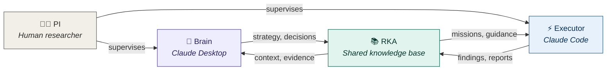
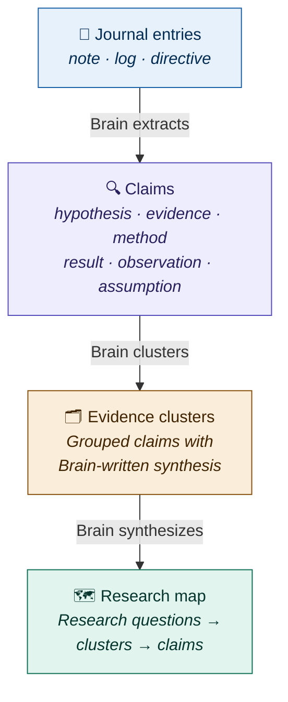
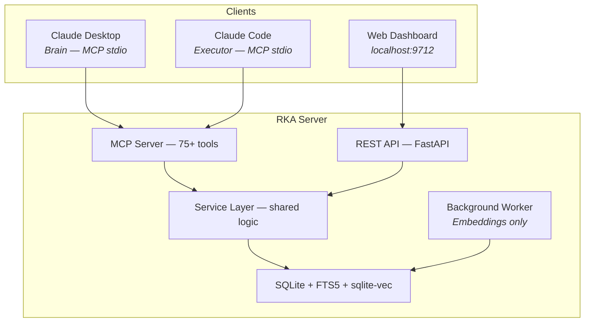

# Research Knowledge Agent (RKA)

[](https://github.com/infinitywings/rka/actions/workflows/pytest.yml)

**Persistent research memory for AI-assisted investigations.**

RKA gives your research project a brain that doesn't forget between sessions. It stores every finding, decision, hypothesis, and literature reference in a structured knowledge base with full provenance chains. The Brain (Claude) handles all knowledge enrichment — no local LLM required.


> **(A)** Three roles — **Researcher** (frames and ratifies), **Brain** (Claude Desktop, synthesizes literature and proposes structured options), **Executor** (Claude Code, implements bounded missions) — share a typed, provenance-aware knowledge base. Four control properties anchor the architecture: traceability, reversibility, visible disagreement, human-ratified commitment.
> **(B)** One operational cycle: the Researcher frames a goal; the Brain restates intent (Confirmation Brief), retrieves context, and proposes structured options; the Researcher ratifies a decision; a mission is dispatched to the Executor; the Executor implements and reports back; the Brain integrates results and opens the next decision cycle.

```
 Month 1                    Month 3                    Month 6
 ┌──────────┐              ┌──────────┐              ┌──────────┐
 │ "We found │              │ "Based on │              │ "We can   │
 │  that..." │              │  3 months │              │  trace    │
 │           │   ┌─────┐   │  of evi-  │   ┌─────┐   │  every    │
 │ (lost     │──▶│ RKA │──▶│  dence..."│──▶│ RKA │──▶│  decision │
 │  next     │   └─────┘   │           │   └─────┘   │  back to  │
 │  session) │              │ (all here)│              │  its why" │
 └──────────┘              └──────────┘              └──────────┘
  Without RKA               With RKA                  With RKA v2
  Findings vanish            Everything persists        Knowledge self-organizes
```

Built for CS/IoT/CPS security research at UNC Charlotte.

## Paper

A working draft describing RKA's architecture, design principles, and evaluation is available as a PDF: **[RKA-paper.pdf](docs/paper/RKA-paper.pdf)** — *Framing Is Human: Researcher–Brain–Executor Architecture for AI-Assisted Research*.

The figure above is Figure 1 of the draft; it provides a one-glance overview of the architecture (panel A) and one operational decision cycle (panel B). The rest of this README is the practical, hands-on companion: setup, CLI, MCP tools, REST API, and the web dashboard. For the conceptual argument and evaluation, read the draft.

---

## How it works

Three actors collaborate through a shared knowledge base:


```mermaid
graph LR
    PI["🧑‍🔬 PI<br/><i>Human researcher</i>"]
    Brain["🧠 Brain<br/><i>Claude Desktop</i>"]
    Executor["⚡ Executor<br/><i>Claude Code</i>"]
    RKA["📚 RKA<br/><i>Shared knowledge base</i>"]

    PI -->|supervises| Brain
    PI -->|supervises| Executor
    Brain -->|"strategy, decisions"| RKA
    Executor -->|"findings, reports"| RKA
    RKA -->|"context, evidence"| Brain
    RKA -->|"missions, guidance"| Executor

    style RKA fill:#E1F5EE,stroke:#0F6E56,color:#04342C
    style Brain fill:#EEEDFE,stroke:#534AB7,color:#26215C
    style Executor fill:#E6F1FB,stroke:#185FA5,color:#042C53
    style PI fill:#F1EFE8,stroke:#5F5E5A,color:#2C2C2A
```

- **Brain** (Claude Desktop) — strategic layer. Interprets findings, decides research direction, reviews evidence clusters, resolves contradictions.
- **Executor** (Claude Code) — implementation layer. Runs experiments, writes code, collects data. Receives missions, submits reports, raises checkpoints when blocked.
- **PI** (human researcher) — supervises both, resolves escalations, provides domain expertise.
- **RKA** — the shared memory. Stores everything, provides context to whoever needs it. A maintenance manifest detects provenance gaps for the Brain to fix.

---

## The knowledge pipeline

Raw observations don't stay raw. The Brain distills journal entries into structured knowledge during maintenance sessions:


```mermaid
graph TD
    Entry["📝 Journal entries<br/><i>note · log · directive</i>"]
    Claims["🔍 Claims<br/><i>hypothesis · evidence · method<br/>result · observation · assumption</i>"]
    Clusters["🗂️ Evidence clusters<br/><i>Grouped claims with<br/>Brain-written synthesis</i>"]
    Map["🗺️ Research map<br/><i>Research questions →<br/>clusters → claims</i>"]

    Entry -->|"Brain extracts"| Claims
    Claims -->|"Brain clusters"| Clusters
    Clusters -->|"Brain synthesizes"| Map

    style Entry fill:#E6F1FB,stroke:#185FA5,color:#042C53
    style Claims fill:#EEEDFE,stroke:#534AB7,color:#26215C
    style Clusters fill:#FAEEDA,stroke:#854F0B,color:#412402
    style Map fill:#E1F5EE,stroke:#0F6E56,color:#04342C
```

Every claim links back to its source entry with character offsets. Every cluster links to its constituent claims. The full provenance chain is always traversable.

---

## The provenance chain

Every entity in RKA knows why it exists. Typed cross-references form a complete reasoning chain:


```mermaid
graph LR
    Lit["📄 Literature<br/><i>MQTT benchmarks</i>"]
    Dec1["🔀 Decision<br/><i>Test broker limits</i>"]
    Mis["📋 Mission<br/><i>Stress test at scale</i>"]
    Entry["📝 Finding<br/><i>12% packet loss</i>"]
    Claim["💡 Claim<br/><i>Threshold at 400</i>"]
    Dec2["🔀 Decision<br/><i>Implement sharding</i>"]

    Lit -->|informed| Dec1
    Dec1 -->|motivated| Mis
    Mis -->|produced| Entry
    Entry -->|derived| Claim
    Claim -->|justified| Dec2

    style Lit fill:#F1EFE8,stroke:#5F5E5A,color:#2C2C2A
    style Dec1 fill:#EEEDFE,stroke:#534AB7,color:#26215C
    style Mis fill:#E6F1FB,stroke:#185FA5,color:#042C53
    style Entry fill:#E1F5EE,stroke:#0F6E56,color:#04342C
    style Claim fill:#FAEEDA,stroke:#854F0B,color:#412402
    style Dec2 fill:#EEEDFE,stroke:#534AB7,color:#26215C
```

12 typed link types: `informed_by` · `justified_by` · `motivated` · `produced` · `cites` · `references` · `supports` · `contradicts` · `supersedes` · `resolved_as` · `derived_from` · `builds_on`

---

## What you can do with RKA

**Record and organize:**

```
Brain:    rka_add_note(content="12% packet loss above 400 connections", type="note", project_id="prj_…")
          rka_add_decision(question="Use horizontal sharding", related_journal=["jrn_…"], project_id="prj_…")
          rka_create_mission(objective="Test sharding", motivated_by_decision="dec_…", project_id="prj_…")

Executor: rka_add_note(content="Ran 500-connection stress test", type="log", project_id="prj_…")
          rka_submit_report(mission_id="mis_…", summary="…", findings="Sharding reduced loss to 2%", project_id="prj_…")
          rka_submit_checkpoint(mission_id="mis_…", type="decision", description="Need PI input on replication factor", project_id="prj_…")
```

**Note (v2.6+):** every project-scoped tool requires `project_id` as a kwarg. There is no "active project" session state — the LLM keeps the project_id in conversation memory and threads it on every call. See `rka/skills/{brain,executor,pi}/SKILL.md` for the discipline.

**Navigate and search:**

```
rka_get_research_map()         → Three-level view: RQs → clusters → claims
rka_trace_provenance(id)       → Literature → decision → mission → finding → claim
rka_get_review_queue()         → Items flagged for Brain's deep reasoning
rka_search("MQTT scalability") → Entries, decisions, literature, claims
rka_get_context(topic="...")   → Importance-ranked context package
rka_multi_hop_retrieval(query="...")  → Query-anchored ranked subgraph
```

---

## Key features

| Category                           | What it does                                                                                                                                                                                                                                                                                                              |
| ---------------------------------- | ------------------------------------------------------------------------------------------------------------------------------------------------------------------------------------------------------------------------------------------------------------------------------------------------------------------------- |
| **Persistent memory**        | Journal entries, decisions, literature, missions, checkpoints — all survive between sessions                                                                                                                                                                                                                             |
| **Progressive distillation** | Brain-driven pipeline: entries → claims → evidence clusters → research themes                                                                                                                                                                                                                                          |
| **Three-layer research map** | Navigate: research questions → evidence clusters → individual claims                                                                                                                                                                                                                                                    |
| **Full provenance**          | 12 typed cross-reference edges forming traceable reasoning chains                                                                                                                                                                                                                                                         |
| **Brain-driven enrichment**  | Brain handles all knowledge enrichment; maintenance manifest detects gaps automatically                                                                                                                                                                                                                                   |
| **Decision lifecycle**       | Overturn decisions with `rka_supersede_decision` — affected claims marked stale for Brain review                                                                                                                                                                                                                       |
| **Hybrid search**            | FTS5 keyword + sqlite-vec embeddings + reciprocal rank fusion                                                                                                                                                                                                                                                             |
| **Multi-project**            | Isolated project databases with MCP tools for switching                                                                                                                                                                                                                                                                   |
| **Web dashboard**            | 12-page React UI: research map with filterable stats, decision tree, knowledge graph, markdown-rendered journal, expandable missions                                                                                                                                                                                      |
| **Onboarding**               | `rka_generate_claude_md` auto-generates project-specific CLAUDE.md from live DB state                                                                                                                                                                                                                                   |
| **Skills plugin**            | Role-specific SKILL.md guides packaged as MCP prompts (Brain, Executor, PI) with worked examples and anti-patterns                                                                                                                                                                                                        |
| **Knowledge freshness**      | Staleness detection and propagation through the dependency graph; contradiction detection via vector similarity                                                                                                                                                                                                           |
| **Validation gates**         | Structured go/no-go checkpoints (Gate 0–3) with Go/Kill/Hold/Recycle verdicts and assumption tracking                                                                                                                                                                                                                    |
| **Cluster management**       | Split large clusters, merge thin ones — claim provenance preserved automatically                                                                                                                                                                                                                                         |
| **Literature workflow**      | `rka_process_paper` captures reading annotations as structured claims in one call                                                                                                                                                                                                                                       |
| **RQ lifecycle**             | Track research questions from open → partially_answered → answered → reframed → closed                                                                                                                                                                                                                                |
| **Evidence assembly**        | `rka_assemble_evidence` produces lit reviews, progress reports, and proposal sections from existing knowledge                                                                                                                                                                                                           |
| **Data integrity**           | Categorized table registry prevents silent data loss during export;`rka_check_integrity` verifies the knowledge graph                                                                                                                                                                                                   |
| **Multi-choice decision UX** | `rka_present_decision` renders structured option sets with Pareto highlights; `rka_record_pi_selection` captures the human choice and `rka_record_outcome` closes the calibration loop with Brier score, ECE, and override-rate metrics                                                                             |
| **Hook system**              | Event-driven automation (migration 019): 5 event types and 8 MCP tools (`rka_add_hook`, `rka_list_hooks`, `rka_enable_hook`/`rka_disable_hook`, `rka_delete_hook`, `rka_get_hook_executions`, `rka_get_brain_notifications`, `rka_clear_brain_notifications`) for drift detection and Brain notifications |
| **Streamable HTTP MCP**      | Optional `rka mcp --transport http` mode for remote / multi-client access (dev-only until OAuth 2.1 lands)                                                                                                                                                                                                              |

---

## Table of Contents

- [Paper](#paper)
- [Architecture](#architecture)
- [Key Concepts](#key-concepts)
- [Installation](#installation)
- [Quick Start](#quick-start)
- [Skills Plugin](#skills-plugin--role-specific-workflow-guidance)
- [Multi-Project Support](#multi-project-support)
- [CLI Reference](#cli-reference)
- [Configuration](#configuration)
- [MCP Tools Reference](#mcp-tools-reference)
- [REST API Reference](#rest-api-reference)
- [Web Dashboard](#web-dashboard)
- [Data Model](#data-model)
- [Search and Context Engine](#search-and-context-engine)
- [Knowledge Enrichment](#knowledge-enrichment)
- [Development](#development)
- [Build Phases](#build-phases)

---

## Architecture

### Brain / Executor Model

RKA implements a three-actor collaboration:


```mermaid
graph TD
    subgraph Clients
        CD["Claude Desktop<br/><i>Brain — MCP stdio</i>"]
        CC["Claude Code<br/><i>Executor — MCP stdio</i>"]
        WEB["Web Dashboard<br/><i>localhost:9712</i>"]
    end

    subgraph "RKA Server"
        MCP["MCP Server — 75+ tools"]
        API["REST API — FastAPI"]
        SVC["Service Layer — shared logic"]
        DB["SQLite + FTS5 + sqlite-vec"]
        WORKER["Background Worker<br/><i>Embeddings only</i>"]
    end

    CD --> MCP
    CC --> MCP
    WEB --> API
    MCP --> SVC
    API --> SVC
    SVC --> DB
    WORKER --> DB
```

- **Brain** (Claude Desktop): Strategic decisions — what to research, which direction to take, how to interpret findings, and which review-queue items to resolve. Communicates via MCP tools.
- **Executor** (Claude Code): Implementation — runs experiments, writes code, collects data. Receives missions, submits reports, raises checkpoints.
- **PI** (Human): Oversees progress, resolves checkpoints, provides domain expertise.

### Four-Layer Design

1. **MCP Tools Layer** — Thin adapter exposing `rka_*` tools over stdio. Keeps lightweight per-session state for output compaction and digests, but no core business logic.
2. **REST API Layer** — FastAPI endpoints under `/api`. Same thin-adapter pattern, delegates to services.
3. **Service Layer** — All business logic. CRUD operations, auto-enrichment, event emission, context preparation, distillation pipeline. Shared identically by MCP and REST.
4. **Infrastructure Layer** — Database (SQLite + FTS5 + sqlite-vec), pluggable embedding backends (FastEmbed default; OpenAI-compatible HTTP; Ollama — configurable via Settings → Embeddings in the web dashboard, see [`docs/embedding_backends.md`](docs/embedding_backends.md)), file storage. The LiteLLM-gated `rka_ask` / `rka_generate_summary` tools were removed in v2.4.0; server-side code is preserved for future re-wiring through the orchestrator's Claude Code SDK.

### Three-Process Model

RKA runs as three processes:

| Process           | Command                  | Purpose                                | Port     |
| ----------------- | ------------------------ | -------------------------------------- | -------- |
| REST API + Web UI | `rka serve`            | HTTP endpoints + static web dashboard  | 9712     |
| Background Worker | started by `rka serve` | Embedding generation, FTS indexing     | internal |
| MCP stdio server  | `rka mcp`              | Tool interface for Claude Desktop/Code | stdio    |

The REST API and background worker share the same SQLite database file and service layer code. The background worker handles embedding generation so that MCP and REST calls return immediately. Knowledge enrichment (claim extraction, cluster synthesis, provenance linking) is handled by the Brain during maintenance sessions — no local LLM is required.

The MCP server communicates via stdio (stdin/stdout) and proxies all calls to the REST API at `RKA_API_URL` (default: `http://localhost:9712`).

---

## Key Concepts

### Entity Types

| Entity                      | Prefix    | Purpose                                                                                                   |
| --------------------------- | --------- | --------------------------------------------------------------------------------------------------------- |
| **Journal Entry**     | `jrn_`  | Research notes — observations, analyses, procedures, and directives                                      |
| **Decision**          | `dec_`  | Decision tree nodes — questions with options, chosen path, rationale                                     |
| **Literature**        | `lit_`  | Papers, articles — tracked through reading pipeline                                                      |
| **Mission**           | `mis_`  | Task packages assigned to the Executor with objectives and acceptance criteria                            |
| **Checkpoint**        | `chk_`  | Escalation points where Executor needs Brain/PI input                                                     |
| **Claim**             | `clm_`  | Extracted assertions from journal entries (hypothesis, evidence, method, result, observation, assumption) |
| **Evidence Cluster**  | `ecl_`  | Groups of related claims with Brain-authored synthesis written during maintenance sessions                |
| **Topic**             | `top_`  | Hierarchical topic taxonomy for organizing knowledge                                                      |
| **Review Queue Item** | `rev_`  | Items flagged for Brain review (low confidence, contradictions, missing evidence)                         |
| **Cross-Reference**   | `link_` | Typed edges forming provenance chains between entities                                                    |
| **Event**             | `evt_`  | Audit trail of all state changes with causal chain links                                                  |
| **Project State**     | —        | Singleton per project: current phase, summary, blockers, metrics                                          |

### Journal Entry Types

v2.0 simplifies journal entry types to three canonical categories:

| Type          | Purpose                                                               |
| ------------- | --------------------------------------------------------------------- |
| `note`      | Observations, analyses, insights — the default type for most entries |
| `log`       | Procedures, methodology steps, experiment records                     |
| `directive` | Instructions from PI or Brain to guide future work                    |

Legacy types from v1 (`finding`, `insight`, `idea`, `observation`, `hypothesis`, `methodology`, `pi_instruction`, `exploration`, `summary`) are accepted as input and automatically mapped to the nearest v2.0 type.

### Progressive Distillation Pipeline

The distillation pipeline is Brain-driven. The Brain extracts claims, clusters evidence, and writes syntheses during maintenance sessions:

```
Journal Entries (note / log / directive)
    |
    | [Brain: claim extraction during maintenance]
    v
Claims (clm_)
  hypothesis | evidence | method | result | observation | assumption
    |
    | [Brain: clustering and synthesis]
    v
Evidence Clusters (ecl_)
  Brain-written synthesis of related claims
    |
    | [Brain: research question assignment]
    v
Research Map
  Research Questions --> Clusters --> Claims
```

`rka_get_pending_maintenance()` detects entries needing distillation and other provenance gaps. The Brain processes these at session start using `rka_extract_claims`, `rka_create_cluster`, and `rka_assign_claims_to_cluster`.

### ULID-Based IDs

All entities use type-prefixed ULIDs (e.g., `dec_01HXYZ...`). ULIDs are globally unique, sortable by creation time, and the prefix makes debugging easier when reading logs or database rows.

### Mission Lifecycle

```
Brain creates mission --> Executor picks up (active) --> Work proceeds
    --> Checkpoint raised if blocked --> Brain/PI resolves
    --> Executor submits report --> Brain reviews
    --> Mission marked complete/partial/blocked
```

### Review Queue

The review queue collects items that need Brain attention: low-confidence claims, contradictions between claims, and clusters needing narrative synthesis. Brain can approve, reject, merge, or override each item.

### Decision Superseding

When a decision is superseded by new evidence, RKA marks the old decision as superseded, links it to the replacement, and optionally re-runs distillation on claims that cited the old decision. This preserves the full audit trail while keeping the active research map current.

### Provenance Chains

Every entity can be linked to its sources via typed `link_` cross-references. Common link types include `derived_from`, `contradicts`, `supports`, `supersedes`, and `cites`. These edges form the provenance graph visible in the Knowledge Graph page.

### Context Ranking (v2.4+)

The Context Engine returns a single ranked list of entries — no token-budget truncation, no temperature bucketing. Ordering is deterministic, computed at SQL time:

1. **`journal.importance`** — `critical` > `high` > `normal` > `low` > `archived`. PI-sourced entries get a small lift within their importance band.
2. **`entity_links` centrality** — sum of inbound + outbound edges; highly-connected nodes surface first within an importance band.
3. **`created_at` DESC** — recency as the tie-breaker.

> Earlier RKA versions (≤ v2.3) used HOT/WARM/COLD temperature bucketing on day-thresholds plus a token budget. Both were removed in v2.4 (see `dec_01KQQPD6Y6B362T3K08368BDMP`): day-thresholds systematically excluded older relevant content, and frontier model context windows make a bookkeeper-imposed budget unnecessary.

For multi-hop questions where the answer depends on connected entities multiple hops from the seeds, see `rka_multi_hop_retrieval` — it returns a query-anchored relevance-ranked subgraph using the typed edge vocabulary with per-relation weights.

---

## Installation

### Option A: Docker (Recommended)

Prerequisites: [Docker Desktop](https://www.docker.com/products/docker-desktop/)

```bash
git clone https://github.com/infinitywings/rka.git
cd rka
docker compose up -d
```

That is it. Open `http://localhost:9712` in your browser.

**Connect Claude Desktop and Claude Code (MCP):**

Both clients reach RKA through the same small `rka` stdio binary. Install once outside Docker so Claude apps can launch it directly:

```bash
UV_CACHE_DIR=/tmp/uv-cache uv tool install --force .
```

The binary lands at `~/.local/bin/rka` and ships role skill prompts (`brain_skill`, `executor_skill`, `pi_skill`) that Claude can load for full workflow guidance.

Then register it in each client's MCP config — full step-by-step setup is in [Quick Start § 2](#2-connect-claude-desktop-and-claude-code) below.

**No LLM required.** The Brain (Claude Desktop) handles all knowledge enrichment — claim extraction, cluster synthesis, contradiction resolution — during normal sessions. There is nothing to configure beyond Docker and the MCP binary.

The MCP binary is stateless — it proxies all calls to the Docker container's REST API at `RKA_API_URL`.

**After code changes**, always reinstall the MCP binary:

```bash
uv tool uninstall rka
rm -rf /tmp/uv-cache
UV_CACHE_DIR=/tmp/uv-cache uv tool install --force --reinstall .
```

Plain `uv tool install --force .` uses cached wheels and may NOT pick up changes.

### Option B: From Source (Development)

Prerequisites:

- Python 3.11+
- Node.js 18+ (for web dashboard)

```bash
git clone https://github.com/infinitywings/rka.git
cd rka

# Create venv and install
python -m venv .venv
source .venv/bin/activate
pip install -e ".[academic,workspace]"

# Build web UI
cd web && npm install && npm run build && cd ..

# Start the server (REST API + background worker)
rka serve
```

**Connect Claude Desktop/Code (MCP):**

```bash
# Install the MCP binary via uv tool (avoids macOS sandbox issues)
UV_CACHE_DIR=/tmp/uv-cache uv tool install --force .
```

Register it in each Claude client per [Quick Start § 2](#2-connect-claude-desktop-and-claude-code) below.

---

## Quick Start

### 1. Start the Server

```bash
# Docker (recommended)
docker compose up -d

# Or from source
rka serve
```

The web dashboard is at `http://localhost:9712`. API docs are at `http://localhost:9712/docs`.

### 2. Connect Claude Desktop and Claude Code

RKA reaches both Claude apps through MCP (Model Context Protocol). You install one small binary and register it with each app.

> **Why two apps?** The Brain (strategy, synthesis) runs in **Claude Desktop**. The Executor (implementation, coding) runs in **Claude Code**. They share the same RKA knowledge base, so context survives across sessions and across roles.
>
> ⚠️ MCP is not available on the [claude.ai](https://claude.ai) website — you need the native Claude Desktop app and the Claude Code extension/CLI.

**Step 2a — Install the RKA MCP binary** (one-time, runs outside Docker so the Claude apps can launch it directly):

```bash
UV_CACHE_DIR=/tmp/uv-cache uv tool install --force .
```

This places `rka` at `~/.local/bin/rka`. Verify with `~/.local/bin/rka --version`.

**Step 2b — Configure Claude Desktop (Brain).** Open Claude Desktop → **Settings → Developer → Edit Config**, or edit the file directly:

| OS | Config file |
|----|-------------|
| macOS   | `~/Library/Application Support/Claude/claude_desktop_config.json` |
| Windows | `%APPDATA%\Claude\claude_desktop_config.json` |
| Linux   | `~/.config/Claude/claude_desktop_config.json` |

Add (or merge into) — replace `<your-username>` with your actual username; the path must be **absolute**, not `~`:

```json
{
  "mcpServers": {
    "rka": {
      "command": "/Users/<your-username>/.local/bin/rka",
      "args": ["mcp"]
    }
  }
}
```

Save and **fully quit Claude Desktop** (Cmd+Q on macOS / right-click tray icon → Quit on Windows), then reopen. RKA tools will now be available in any new conversation.

**Step 2c — Configure Claude Code (Executor).** Either through the VS Code extension's **MCP Servers** UI, or by creating a `.claude/mcp.json` in your repo root:

```json
{
  "mcpServers": {
    "rka": {
      "command": "/Users/<your-username>/.local/bin/rka",
      "args": ["mcp"]
    }
  }
}
```

Reload the VS Code window: **Cmd+Shift+P** (macOS) / **Ctrl+Shift+P** (Windows/Linux) → **"Developer: Reload Window"**.

If you use the Claude Code CLI rather than the VS Code extension, the same config goes in `~/.claude/settings.json` under `mcpServers`.

**Pinning the project (v2.6+).** v2.6 removed the `RKA_PROJECT` env-var "default project" mechanism — it reintroduced the silent-default failure mode that v2.6 explicitly eliminates. Every project-scoped rka_* tool now requires `project_id` as a kwarg, and the LLM keeps the project_id in conversation memory and threads it on every call. The discipline:

> At the start of every conversation, state the project: *"I'm working on prj_01KSMW9R…"* (or *"on the hyperscaler-auditing project"* — the LLM resolves the slug via `rka_list_projects()`). The LLM retains it in working memory and passes `project_id="prj_…"` to every rka_* tool call.

If the LLM ever omits `project_id`, the tool raises `TypeError: rka_X() missing 1 required keyword-only argument: 'project_id'` — by design. That replaces the pre-v2.6 silent writes to `proj_default`.

To find a project id, run `rka_list_projects()` once in any session, or check `http://localhost:9712` in the dashboard URL bar.

**The navigator architecture (v2.6.3+).** Since v2.6.3 the rka MCP server ships **12 always-on tools** (status, context, pending maintenance, checkpoints, research map, search, get, add-note, resolve-checkpoint, plus the navigator triad `rka_load_tools` / `rka_list_tools` / `rka_help`). The remaining ~79 tools — including `rka_list_projects`, `rka_add_decision`, `rka_create_mission`, `rka_get_journal`, `rka_get_report`, and every other project-scoped lifecycle tool — are **deferred**: present on the server but not advertised until a client registers them via `rka_load_tools(names=[...])`. Browse the catalog with `rka_list_tools(category=...)`; inspect a single tool with `rka_help(name=...)`. Both Claude Desktop and Claude Code honor MCP's `notifications/tools/list_changed` event, so a freshly-loaded tool becomes callable mid-session without a reconnect. The Brain / Executor / PI skills shipped under `rka/skills/` know about this and will load the tools they need at session start.

**Step 2d — Verify.** In each app, ask:

> "List my RKA projects"

Each Claude should first load the tool — `rka_load_tools(names=["rka_list_projects"])` — and then call `rka_list_projects()` and return a list (empty on a fresh install).

**Step 2e — Load the role skill** (recommended each new session). MCP **prompts** ship with the binary; they teach Claude the session-start protocol, attribution discipline, and provenance rules.

In Claude Desktop, ask: *"Load your brain skill."* In Claude Code, ask: *"Load your executor skill."* Or invoke explicitly via the `/` slash menu → **rka → brain_skill** / **executor_skill**.

For the full setup walkthrough including troubleshooting, see [USAGE_GUIDE.md](USAGE_GUIDE.md).

#### MCP Transport Modes

The `rka mcp` binary supports two transport modes:

- **Stdio (default)** — `rka mcp` with no arguments. Claude Desktop and Claude Code spawn the binary as a subprocess and communicate over stdin/stdout. This is the mode the install instructions above configure.
- **Streamable HTTP (opt-in, v2.2+)** — `rka mcp --transport http --port 9713` runs the server on `http://127.0.0.1:9713/mcp`. Useful for remote access, multi-client scenarios, or mitmproxy-based protocol debugging. Enable via the `--transport http` flag or `RKA_MCP_TRANSPORT=http` env var. Authentication is not yet implemented — treat HTTP mode as dev/internal only until a future mission adds OAuth 2.1.

The tool surface is identical across transports. Docker's default command still launches stdio-nothing there has changed.

### 3. Generate Onboarding Instructions (Optional)

Run `rka_generate_claude_md` from Claude Desktop or hit `GET /api/generate-claude-md?role=executor` to generate a customized `CLAUDE.md` for the current project and role. This gives new sessions immediate context on project goals, conventions, and active work.

### 4. Try the Example Project (Optional)

RKA ships with an example knowledge pack — the `rka_development` project used to build RKA itself. Import it to explore a fully populated knowledge base with 80 journal entries, 22 decisions, 10 literature references, 3 missions, and 279 cross-references:

```bash
curl -X POST http://localhost:9712/api/projects/import \
  -F "file=@examples/rka_development.rka-pack.zip"
```

Or use the web dashboard: open **Dashboard** → **Import Pack** → select `examples/rka_development.rka-pack.zip`.

After import, switch to the project in the sidebar and explore the Decision Tree, Knowledge Graph, and Research Map to see how a real project looks.

### 5. Start Researching

Use the web UI for browsing and Q&A, or use Claude Desktop/Code with MCP tools for the full Brain/Executor workflow. The dashboard lets you select the active project, browse the Research Map, manage the review queue, and export the active project as a knowledge pack.

For end-to-end task walkthroughs, see [USAGE_GUIDE.md](USAGE_GUIDE.md) or the [Wiki](https://github.com/infinitywings/rka/wiki).

---

## Skills Plugin — Role-Specific Workflow Guidance

RKA ships with role-specific skill guides that teach Claude how to use the tools effectively. These are packaged with the MCP binary and available as MCP prompts.

### Available Skills

| Skill              | Target           | Content                                                                                                                                                                                               |
| ------------------ | ---------------- | ----------------------------------------------------------------------------------------------------------------------------------------------------------------------------------------------------- |
| `brain_skill`    | Claude Desktop   | Session start protocol, PI attribution, provenance discipline, claim extraction, multi-task parsing, Research Map workflow, confirmation briefs, knowledge freshness, validation gates, anti-patterns |
| `executor_skill` | Claude Code      | Mission pickup protocol, backbrief procedure, recording standards, escalation triggers, report submission, MCP binary reinstall, cross-role awareness                                                 |
| `pi_skill`       | Human researcher | Quick reference for checking status, reading the research map, reviewing decisions, finding what changed                                                                                              |

### How Skills Are Loaded

The MCP server instructions tell Claude to load the appropriate skill prompt at session start. Claude Desktop loads `brain_skill`; Claude Code loads `executor_skill`. The PI can read `skills/pi/SKILL.md` directly.

### Key Workflows

**Brain session start (v2.6+):**

1. Pin `project_id` from the conversation context (ask the PI if it's not stated)
2. `rka_get_changelog(project_id="prj_…", since="yesterday")` → `rka_get_research_map(project_id="prj_…")`
3. Process up to 10 maintenance items silently
4. Greet the user

**Executor mission pickup:**

1. `rka_get_mission()` → read `motivated_by_decision` → read context links
2. Present a Backbrief (plan summary, assumptions, risks)
3. Wait for Brain approval before starting

**Validation gates (go/no-go checkpoints):**

1. `rka_create_gate(mission_id, gate_type, deliverables, pass_criteria)`
2. Work proceeds → deliverables created
3. `rka_evaluate_gate(gate_id, verdict, notes, assumption_status)`
4. If assumptions invalidated → staleness cascades through the knowledge graph

---

## Multi-Project Support

Multi-project management is available through both MCP and REST:

- **MCP tools**: `rka_list_projects` lists all projects. `rka_create_project` creates a new project. `rka_set_project` is a deprecated no-op in v2.6+ (kept for backward-compat); pass `project_id` to every project-scoped tool call explicitly instead.
- **REST API and web dashboard**: Project-aware. The dashboard stores the active project locally and injects `X-RKA-Project` on API requests automatically.
- **Knowledge packs**: Export the active project with `GET /api/projects/export`. Import a previously exported pack with `POST /api/projects/import`. Import creates a separate project, remaps project-scoped entity IDs, and rewrites internal references.
- **Workspace bootstrap**: CLI bootstrap commands target the current database/default project. For project-specific bootstrap in a multi-project database, use `POST /api/workspace/scan` and `POST /api/workspace/ingest` with `X-RKA-Project`.

---

## CLI Reference

### `rka init <name>`

Initialize a new RKA workspace and seed the default project.

```bash
rka init "IoT Security Analysis" --description "Systematic review of CPS vulnerabilities"
```

| Option            | Default | Description         |
| ----------------- | ------- | ------------------- |
| `--description` | `""`  | Project description |
| `--dir`         | `.`   | Project directory   |

### `rka serve`

Start the REST API + web dashboard server and the background worker.

```bash
rka serve --port 9712 --reload
```

| Option       | Default       | Description                            |
| ------------ | ------------- | -------------------------------------- |
| `--host`   | `127.0.0.1` | Bind address                           |
| `--port`   | `9712`      | Port number                            |
| `--reload` | `false`     | Auto-reload on code changes (dev mode) |

### `rka mcp`

Start the MCP stdio server for Claude Desktop or Claude Code. The MCP server is stateless — it proxies all calls to the REST API at `RKA_API_URL`.

```bash
rka mcp
```

No options — communicates via stdin/stdout per the MCP protocol.

### `rka status`

Show current project state.

```bash
rka status
```

Displays: project name, current phase, active mission, open checkpoints, entity counts.

### `rka backup`

Backup the SQLite database.

```bash
rka backup --output ./backups/rka-backup.db
```

| Option       | Default          | Description            |
| ------------ | ---------------- | ---------------------- |
| `--output` | Timestamped file | Output path for backup |

### `rka migrate`

Run pending database migrations.

```bash
rka migrate
```

### `rka bootstrap scan <folder>`

Scan a workspace folder and classify files for ingestion into the knowledge base.

```bash
rka bootstrap scan ~/research/project_files --no-llm
```

| Option            | Default   | Description                             |
| ----------------- | --------- | --------------------------------------- |
| `--ignore`      | —        | Additional ignore patterns (repeatable) |
| `--no-llm`      | `false` | Disable LLM-enhanced classification     |
| `--json-output` | `false` | Output raw JSON manifest                |

### `rka bootstrap ingest <folder>`

Scan and ingest a workspace folder into the knowledge base.

```bash
rka bootstrap ingest ~/research/project_files --phase phase_1 --tags bootstrap -y
```

| Option        | Default   | Description                             |
| ------------- | --------- | --------------------------------------- |
| `--phase`   | `None`  | Research phase for all entries          |
| `--tags`    | —        | Tags to add to all entries (repeatable) |
| `--skip`    | —        | Relative paths to skip (repeatable)     |
| `--no-llm`  | `false` | Disable LLM-enhanced classification     |
| `--dry-run` | `false` | Preview without creating entries        |
| `--yes`     | `false` | Skip confirmation prompt                |

These CLI bootstrap commands target the current database/default project. In a multi-project deployment, use `POST /api/workspace/scan` and `POST /api/workspace/ingest` with `X-RKA-Project` to bootstrap a specific project.

---

## Configuration

All settings use environment variables with the `RKA_` prefix. Place them in a `.env` file in your project directory.

### Core Settings

| Variable            | Default                   | Description                |
| ------------------- | ------------------------- | -------------------------- |
| `RKA_PROJECT_DIR` | `.`                     | Project root directory     |
| `RKA_DB_PATH`     | `rka.db`                | SQLite database file path  |
| `RKA_HOST`        | `127.0.0.1`             | API server bind address    |
| `RKA_PORT`        | `9712`                  | API server port            |
| `RKA_API_URL`     | `http://localhost:9712` | REST API URL for MCP proxy |

### Embedding Settings

| Variable                   | Default                            | Description                 |
| -------------------------- | ---------------------------------- | --------------------------- |
| `RKA_EMBEDDINGS_ENABLED` | `false`                          | Enable embedding generation |
| `RKA_EMBEDDING_MODEL`    | `nomic-ai/nomic-embed-text-v1.5` | FastEmbed model name        |

### Context Engine Settings

The v2.4 context engine has no tunable env vars — ranking is SQL-time importance × centrality × recency, deterministic and bookkeeper-only. The legacy `RKA_CONTEXT_HOT_DAYS`, `RKA_CONTEXT_WARM_DAYS`, and `RKA_CONTEXT_DEFAULT_MAX_TOKENS` env vars were removed in v2.4 (see "Context Ranking" section above).

---

## MCP Tools Reference

All tools are prefixed with `rka_` and available through the MCP stdio interface. The MCP server is defined in `rka/mcp/server.py`.

### Project

| Tool                   | Purpose                                                       |
| ---------------------- | ------------------------------------------------------------- |
| `rka_list_projects`  | List all projects with name, description, and ID (unscoped — no project_id needed) |
| `rka_create_project` | Create a new project (unscoped — returns the new project_id)  |
| `rka_set_project`    | **Deprecated no-op (v2.6+).** Validates that a project exists; does NOT change subsequent tool behavior. Pass `project_id` on every call instead. |
| `rka_get_status`     | Get current project state (phase, summary, blockers, metrics) |
| `rka_update_status`  | Update project state                                          |

### Notes

| Tool                | Purpose                                                                                                         |
| ------------------- | --------------------------------------------------------------------------------------------------------------- |
| `rka_add_note`    | Add a journal entry with optional tags; type is note, log, or directive (legacy types are mapped automatically) |
| `rka_update_note` | Update an existing journal entry                                                                                |
| `rka_get_journal` | Query journal entries with filters (type, phase, confidence, since)                                             |

### Decisions

| Tool                      | Purpose                                                                |
| ------------------------- | ---------------------------------------------------------------------- |
| `rka_add_decision`      | Add a decision node to the research decision tree                      |
| `rka_update_decision`   | Update a decision (change status, record chosen option, add rationale) |
| `rka_get_decision_tree` | Get the full decision tree structure                                   |

### Literature

| Tool                      | Purpose                                                                                                         |
| ------------------------- | --------------------------------------------------------------------------------------------------------------- |
| `rka_add_literature`    | Add a literature entry (paper, article, book)                                                                   |
| `rka_update_literature` | Update any literature field (title, authors, year, venue, doi, abstract, status, methodology_notes, tags, etc.) |
| `rka_get_literature`    | Query literature with filters                                                                                   |
| `rka_enrich_doi`        | Enrich a literature entry by looking up its DOI via CrossRef                                                    |

### Missions

| Tool                          | Purpose                                                                           |
| ----------------------------- | --------------------------------------------------------------------------------- |
| `rka_create_mission`        | Create a mission for the Executor with objectives, tasks, and acceptance criteria |
| `rka_get_mission`           | Get a mission by ID, or the current active mission                                |
| `rka_update_mission_status` | Update mission status and task progress                                           |
| `rka_submit_report`         | Submit an execution report for a completed/partial mission                        |
| `rka_get_report`            | Retrieve a mission report                                                         |

### Checkpoints (Escalation)

| Tool                       | Purpose                                                |
| -------------------------- | ------------------------------------------------------ |
| `rka_submit_checkpoint`  | Raise a decision/clarification/inspection checkpoint   |
| `rka_get_checkpoints`    | List checkpoints by status (open, resolved, dismissed) |
| `rka_resolve_checkpoint` | Resolve a checkpoint with a decision and rationale     |

### Research Map (v2.0)

| Tool                             | Purpose                                                                                           |
| -------------------------------- | ------------------------------------------------------------------------------------------------- |
| `rka_get_research_map`         | Get the three-level research map: research questions, evidence clusters, and claims               |
| `rka_get_claims`               | Query extracted claims with filters (type, confidence, cluster, entry_id)                         |
| `rka_extract_claims`           | Brain creates claims from a journal entry (takes entry_id + list of claim objects)                |
| `rka_create_cluster`           | Brain creates an evidence cluster, optionally assigning claims in one call                        |
| `rka_assign_claims_to_cluster` | Brain wires existing claims to an existing cluster via member_of edges                            |
| `rka_supersede_decision`       | Mark a decision as superseded by a new decision, with optional re-distillation of affected claims |
| `rka_trace_provenance`         | Trace the full provenance chain for an entity — all upstream sources and downstream derivatives  |

### Cluster Management (v2.1)

| Tool                   | Purpose                                                              |
| ---------------------- | -------------------------------------------------------------------- |
| `rka_list_clusters`  | List evidence clusters with claim counts, confidence, and synthesis  |
| `rka_split_cluster`  | Split a cluster into multiple new clusters by reassigning its claims |
| `rka_merge_clusters` | Merge multiple clusters into one new cluster                         |

### Review Queue (v2.0)

| Tool                          | Purpose                                                                            |
| ----------------------------- | ---------------------------------------------------------------------------------- |
| `rka_get_review_queue`      | List items in the review queue (low confidence, contradictions, synthesis needed)  |
| `rka_review_cluster`        | Review and approve or revise an evidence cluster's synthesized summary             |
| `rka_review_claims`         | Review a set of claims — accept, reject, merge, or flag for further investigation |
| `rka_resolve_contradiction` | Resolve a contradiction between two claims with a rationale and disposition        |

### Knowledge Freshness (v2.1)

| Tool                          | Purpose                                                                                                         |
| ----------------------------- | --------------------------------------------------------------------------------------------------------------- |
| `rka_flag_stale`            | Flag a claim, cluster, or decision as stale (yellow/red) with optional propagation through the dependency graph |
| `rka_check_freshness`       | Scan for potentially stale knowledge: aging claims, superseded sources, stale clusters and decisions            |
| `rka_detect_contradictions` | Find claims that may contradict a given claim using vector similarity or FTS fallback                           |

### Validation Gates (v2.1)

| Tool                  | Purpose                                                                                                       |
| --------------------- | ------------------------------------------------------------------------------------------------------------- |
| `rka_create_gate`   | Create a validation gate checkpoint (problem_framing, plan_validation, evidence_review, synthesis_validation) |
| `rka_evaluate_gate` | Evaluate a gate with Go/Kill/Hold/Recycle verdict; invalidated assumptions auto-cascade staleness             |

### Researcher Experience (v2.1)

| Tool                      | Purpose                                                                                                              |
| ------------------------- | -------------------------------------------------------------------------------------------------------------------- |
| `rka_get_changelog`     | Cross-entity temporal view — what changed since a given date across all entity types                                |
| `rka_assemble_evidence` | Assemble evidence under a research question into structured markdown (lit_review, progress_report, proposal_section) |
| `rka_process_paper`     | Literature reading workflow — create reading notes + extract claims from annotations in one call                    |
| `rka_advance_rq`        | Advance a research question's lifecycle (open → partially_answered → answered → reframed → closed)               |
| `rka_check_integrity`   | Verify knowledge base integrity — orphaned edges, missing references, count mismatches                              |

### Search and Context

| Tool                   | Purpose                                                              |
| ---------------------- | -------------------------------------------------------------------- |
| `rka_search`         | Hybrid search across all entity types                                |
| `rka_get_context`    | Importance-ranked context package (v2.4: no token budget; ordered by importance × centrality × recency) |
| `rka_multi_hop_retrieval` | Query-anchored relevance-ranked subgraph traversing typed edges with per-relation weights |
| `rka_summarize`      | On-demand topic summarization                                        |
| `rka_eviction_sweep` | Propose entries for archival based on staleness                      |

### Graph

| Tool                  | Purpose                                                  |
| --------------------- | -------------------------------------------------------- |
| `rka_get_graph`     | Get the full entity relationship graph                   |
| `rka_get_ego_graph` | Get the ego graph centered on a specific entity          |
| `rka_graph_stats`   | Get graph statistics (node counts, edge counts, density) |

### Academic Import and Enrichment

| Tool                            | Purpose                                                                                               |
| ------------------------------- | ----------------------------------------------------------------------------------------------------- |
| `rka_search_semantic_scholar` | Search Semantic Scholar for papers by query, with optional year/field filters and auto-add to library |
| `rka_search_arxiv`            | Search arXiv for papers by query, with sort options and optional auto-add to library                  |
| `rka_search_elicit`           | Search Elicit for papers relevant to a research question                                              |
| `rka_import_bibtex`           | Import literature entries from a BibTeX string (auto-detects duplicates by DOI and title)             |

### Workspace Bootstrap

| Tool                        | Purpose                                                                                      |
| --------------------------- | -------------------------------------------------------------------------------------------- |
| `rka_scan_workspace`      | Scan a folder and classify files for ingestion (regex heuristics + optional LLM enhancement) |
| `rka_bootstrap_workspace` | One-shot scan + ingest: classify and import all files into the knowledge base                |
| `rka_review_bootstrap`    | Review a completed bootstrap — entry counts, suggestions, and narrative for Brain handoff   |

### Session

| Tool                   | Purpose                                                         |
| ---------------------- | --------------------------------------------------------------- |
| `rka_session_digest` | Generate a digest of the current session's activity for handoff |
| `rka_reset_session`  | Reset per-session state (compaction counters, digest buffer)    |

### Onboarding (v2.0)

| Tool                       | Purpose                                                                           |
| -------------------------- | --------------------------------------------------------------------------------- |
| `rka_generate_claude_md` | Generate a customized CLAUDE.md for the active project and role (executor, brain) |

### Export

| Tool                   | Purpose                                                                                                 |
| ---------------------- | ------------------------------------------------------------------------------------------------------- |
| `rka_export`         | Export research data as markdown, JSON, or Mermaid diagram (scopes: state, decisions, literature, full) |
| `rka_export_mermaid` | Export the decision tree as a Mermaid flowchart with status-based styling                               |

---

## REST API Reference

Base URL: `http://localhost:9712/api`

Interactive API docs available at `http://localhost:9712/docs` (Swagger UI).

Most entity endpoints are project-scoped. Pass `X-RKA-Project: <project_id>` (or `?project_id=…` query param) on every request to target a specific project. If omitted, the server falls back to `DEFAULT_PROJECT_ID` = `proj_default` (the always-present sentinel project). v2.6 removed the pre-v2.6 `RKA_PROJECT` env-var override on this fallback — the explicit-only contract is now consistent across both the MCP layer and the REST layer.

#### Request validation (v2.3.1+)

The eight core entity update models (`DecisionUpdate`, `MissionUpdate`, `JournalEntryUpdate`, `LiteratureUpdate`, `ClaimUpdate`, `EvidenceClusterUpdate`, `TopicUpdate`, `ProjectStateUpdate`) use Pydantic `extra="forbid"`. POST/PUT requests carrying fields not declared in the corresponding model now return **HTTP 422** instead of silently stripping them. Pre-2.3.1 the strip was a documented bug ([commit `02d7348`](https://github.com/infinitywings/rka/commit/02d7348) introduces the constraint). Anyone bisecting unexpected 422s on update endpoints should land at that commit.

`MissionUpdate` was previously narrower than the read projection (3 declared fields). It now also accepts `phase`, `context`, `acceptance_criteria`, `scope_boundaries`, `checkpoint_triggers`, `depends_on`, `parent_mission_id`, `motivated_by_decision`, and `tags`. Writes to these fields via REST PUT now persist (and the `motivated_by_decision` write also materializes the corresponding `motivated` entity_link). `DecisionUpdate` similarly added `assumptions`.

### Notes (Journal Entries)

| Method   | Endpoint        | Description                                                                                 |
| -------- | --------------- | ------------------------------------------------------------------------------------------- |
| `POST` | `/notes`      | Create a journal entry                                                                      |
| `GET`  | `/notes`      | List entries (filters: type, phase, confidence, importance, source, since, hide_superseded) |
| `GET`  | `/notes/{id}` | Get a single entry                                                                          |
| `PUT`  | `/notes/{id}` | Update an entry                                                                             |

### Decisions

| Method   | Endpoint                      | Description                                                                    |
| -------- | ----------------------------- | ------------------------------------------------------------------------------ |
| `POST` | `/decisions`                | Create a decision node                                                         |
| `GET`  | `/decisions`                | List decisions (filters: phase, status, parent_id)                             |
| `GET`  | `/decisions/tree`           | Get the full tree structure (for visualization)                                |
| `GET`  | `/decisions/{id}`           | Get a single decision with options                                             |
| `PUT`  | `/decisions/{id}`           | Update a decision                                                              |
| `POST` | `/decisions/{id}/supersede` | Supersede a decision with a replacement, optionally triggering re-distillation |

### Literature

| Method   | Endpoint             | Description                                              |
| -------- | -------------------- | -------------------------------------------------------- |
| `POST` | `/literature`      | Add a literature entry                                   |
| `GET`  | `/literature`      | List entries (filters: status, year range, venue, query) |
| `GET`  | `/literature/{id}` | Get a single entry                                       |
| `PUT`  | `/literature/{id}` | Update an entry                                          |

### Missions

| Method   | Endpoint                  | Description                            |
| -------- | ------------------------- | -------------------------------------- |
| `POST` | `/missions`             | Create a mission                       |
| `GET`  | `/missions`             | List missions (filters: phase, status) |
| `GET`  | `/missions/{id}`        | Get a single mission                   |
| `PUT`  | `/missions/{id}`        | Update a mission                       |
| `POST` | `/missions/{id}/report` | Submit an execution report             |
| `GET`  | `/missions/{id}/report` | Get the mission report                 |

### Checkpoints

| Method   | Endpoint                      | Description                                    |
| -------- | ----------------------------- | ---------------------------------------------- |
| `POST` | `/checkpoints`              | Create a checkpoint                            |
| `GET`  | `/checkpoints`              | List checkpoints (filters: status, mission_id) |
| `GET`  | `/checkpoints/{id}`         | Get a single checkpoint                        |
| `PUT`  | `/checkpoints/{id}/resolve` | Resolve a checkpoint                           |

### Claims (v2.0)

| Method   | Endpoint          | Description                                                                   |
| -------- | ----------------- | ----------------------------------------------------------------------------- |
| `POST` | `/claims`       | Create a claim manually or trigger extraction from a journal entry            |
| `GET`  | `/claims`       | List claims (filters: type, confidence, cluster_id, entry_id)                 |
| `GET`  | `/claims/{id}`  | Get a single claim with provenance links                                      |
| `POST` | `/claims/edges` | Create a claim edge (member_of, supports, contradicts, qualifies, supersedes) |

### Evidence Clusters (v2.0)

| Method   | Endpoint           | Description                                             |
| -------- | ------------------ | ------------------------------------------------------- |
| `POST` | `/clusters`      | Create an evidence cluster                              |
| `GET`  | `/clusters`      | List clusters (filters: topic_id, has_synthesis, since) |
| `GET`  | `/clusters/{id}` | Get a single cluster with member claims                 |
| `PUT`  | `/clusters/{id}` | Update a cluster (revise synthesis, update topic)       |

### Topics (v2.0)

| Method   | Endpoint         | Description                             |
| -------- | ---------------- | --------------------------------------- |
| `POST` | `/topics`      | Create a topic                          |
| `GET`  | `/topics`      | List topics (filters: parent_id, depth) |
| `GET`  | `/topics/{id}` | Get a single topic                      |
| `PUT`  | `/topics/{id}` | Update a topic                          |
| `GET`  | `/topics/tree` | Get the full hierarchical topic tree    |

### Research Map (v2.0)

| Method  | Endpoint                                      | Description                                                                |
| ------- | --------------------------------------------- | -------------------------------------------------------------------------- |
| `GET` | `/research-map`                             | Get the three-level research map: RQs, clusters, and representative claims |
| `GET` | `/research-map/rq/{rq_id}/clusters`         | Get all clusters under a research question                                 |
| `GET` | `/research-map/cluster/{cluster_id}/claims` | Get all claims within a cluster                                            |

### Review Queue (v2.0)

| Method   | Endpoint                       | Description                                              |
| -------- | ------------------------------ | -------------------------------------------------------- |
| `GET`  | `/review-queue`              | List review-queue items (filters: status, reason, since) |
| `POST` | `/review-queue`              | Add an item to the review queue manually                 |
| `PUT`  | `/review-queue/{id}/resolve` | Resolve a review-queue item with a disposition           |

### Researcher Tools (v2.1)

| Method   | Endpoint                        | Description                                                                |
| -------- | ------------------------------- | -------------------------------------------------------------------------- |
| `GET`  | `/changelog`                  | Cross-entity temporal view (query:`since`, `limit`)                    |
| `GET`  | `/assemble-evidence`          | Assemble evidence as markdown (query:`research_question_id`, `format`) |
| `POST` | `/clusters/split`             | Split a cluster into multiple new clusters                                 |
| `POST` | `/clusters/merge`             | Merge multiple clusters into one                                           |
| `POST` | `/literature/process-paper`   | Process paper annotations into claims                                      |
| `POST` | `/research-questions/advance` | Advance an RQ lifecycle status                                             |

### Knowledge Freshness (v2.1)

| Method   | Endpoint                             | Description                                                |
| -------- | ------------------------------------ | ---------------------------------------------------------- |
| `POST` | `/freshness/flag-stale`            | Flag an entity as stale with optional propagation          |
| `GET`  | `/freshness/check`                 | Scan for potentially stale items                           |
| `POST` | `/freshness/detect-contradictions` | Find contradiction candidates via vector similarity or FTS |
| `GET`  | `/integrity`                       | Run knowledge base integrity check                         |

### Search and Context

| Method   | Endpoint            | Description                     |
| -------- | ------------------- | ------------------------------- |
| `POST` | `/search`         | Hybrid search (FTS5 + semantic) |
| `POST` | `/context`        | Generate a context package      |
| `POST` | `/summarize`      | On-demand summarization         |
| `POST` | `/eviction-sweep` | Propose entries for archival    |

### Project and Knowledge Packs

| Method     | Endpoint                         | Description                                                       |
| ---------- | -------------------------------- | ----------------------------------------------------------------- |
| `GET`    | `/projects`                    | List project metadata                                             |
| `POST`   | `/projects`                    | Create a project                                                  |
| `DELETE` | `/projects/{id}?confirm=true`  | Delete a project and all its data (requires confirm=true)         |
| `GET`    | `/projects/{id}/entity-counts` | Get entity counts for a project (pre-deletion check)              |
| `GET`    | `/status`                      | Get project state                                                 |
| `PUT`    | `/status`                      | Update project state                                              |
| `GET`    | `/projects/export`             | Export the active project as a knowledge-pack zip                 |
| `POST`   | `/projects/import`             | Import a knowledge-pack zip into a new project                    |
| `GET`    | `/maintenance`                 | Get pending maintenance manifest (provenance gaps, missing links) |
| `GET`    | `/health`                      | Health check (version, sqlite-vec status)                         |

### Embedding Configuration (v2.4.0)

| Method   | Endpoint                                       | Description                                                |
| -------- | ---------------------------------------------- | ---------------------------------------------------------- |
| `GET`  | `/config/embedding`                          | Current embedding backend config (api_key redacted)        |
| `PUT`  | `/config/embedding?actor=...`                | Save config + test + kick off backfill if backend/dim changed (202) or no-op (200) |
| `POST` | `/config/embedding/test`                     | Probe backend reachability + dim detection (no persist)    |
| `GET`  | `/config/embedding/backfill/status[?job_id=…]` | Poll the running backfill's progress                       |

Full reference: [`docs/embedding_backends.md`](docs/embedding_backends.md).

### LLM Routes (preserved; unconfigured at v2.4.0)

The `/api/llm/*` routes and the `rka_ask` / `rka_generate_summary`
MCP tools remain in the codebase but are no longer surfaced in the
web UI. v2.4.0 removed the LLM config knob per PI directive
`jrn_01KRNZBS50K250HHHHEC58E4GC`; a future release will re-wire LLM
features through the orchestrator's Claude Code SDK path.

| Method   | Endpoint        | Description                                                |
| -------- | --------------- | ---------------------------------------------------------- |
| `GET`  | `/llm/status` | LLM config, availability, model, context window (graceful no-op) |
| `PUT`  | `/llm/config` | Update LLM settings (no longer driven by the UI)           |
| `POST` | `/llm/check`  | Re-check LLM connectivity                                  |
| `GET`  | `/llm/models` | List models available on the configured backend            |

### Notebook (Q&A + Summaries)

| Method   | Endpoint                  | Description                                              |
| -------- | ------------------------- | -------------------------------------------------------- |
| `POST` | `/notebook/qa`          | Ask a question grounded in the knowledge base            |
| `GET`  | `/notebook/qa/sessions` | List Q&A sessions                                        |
| `POST` | `/notebook/summary`     | Generate a summary (scope: project, phase, mission, tag) |
| `GET`  | `/notebook/summaries`   | List generated summaries                                 |

### Knowledge Graph

| Method  | Endpoint                   | Description                         |
| ------- | -------------------------- | ----------------------------------- |
| `GET` | `/graph`                 | Get full entity relationship graph  |
| `GET` | `/graph/ego/{entity_id}` | Get ego graph centered on an entity |
| `GET` | `/graph/stats`           | Graph statistics                    |

### Artifacts and Figures

| Method   | Endpoint                             | Description                                      |
| -------- | ------------------------------------ | ------------------------------------------------ |
| `POST` | `/artifacts`                       | Register an artifact file for the active project |
| `GET`  | `/artifacts`                       | List artifacts                                   |
| `GET`  | `/artifacts/{artifact_id}`         | Get an artifact                                  |
| `POST` | `/artifacts/{artifact_id}/extract` | Extract figures and tables from an artifact      |
| `GET`  | `/artifacts/{artifact_id}/figures` | List figures for an artifact                     |
| `GET`  | `/figures/{figure_id}`             | Get a single extracted figure                    |

### Events and Tags

| Method  | Endpoint    | Description                                                               |
| ------- | ----------- | ------------------------------------------------------------------------- |
| `GET` | `/events` | List audit events (filters: phase, event_type, entity_type, actor, since) |
| `GET` | `/tags`   | List tags with counts (filter: entity_type)                               |

### Audit Log

| Method  | Endpoint          | Description                                                                               |
| ------- | ----------------- | ----------------------------------------------------------------------------------------- |
| `GET` | `/audit`        | List audit entries (filters: action, entity_type, entity_id, actor, since, limit, offset) |
| `GET` | `/audit/counts` | Audit entry counts grouped by action type                                                 |

### Workspace Bootstrap

| Method   | Endpoint                        | Description                                               |
| -------- | ------------------------------- | --------------------------------------------------------- |
| `POST` | `/workspace/scan`             | Scan a workspace folder and classify files for ingestion  |
| `POST` | `/workspace/ingest`           | Ingest files from a scan manifest into the knowledge base |
| `GET`  | `/workspace/review/{scan_id}` | Review a completed bootstrap (entry counts, suggestions)  |

### Academic Import

| Method   | Endpoint                        | Description                                                  |
| -------- | ------------------------------- | ------------------------------------------------------------ |
| `POST` | `/import/bibtex`              | Import literature entries from BibTeX content                |
| `POST` | `/import/bibtex-file`         | Import literature entries from an uploaded .bib file         |
| `POST` | `/literature/{id}/enrich-doi` | Enrich a literature entry by looking up its DOI via CrossRef |
| `GET`  | `/decisions/mermaid`          | Export the decision tree as a Mermaid flowchart diagram      |
| `POST` | `/import/batch`               | Batch import multiple entities of different types            |
| `POST` | `/ingest/document`            | Ingest a markdown document by splitting into journal entries |

### Onboarding (v2.0)

| Method  | Endpoint                | Description                                                                                             |
| ------- | ----------------------- | ------------------------------------------------------------------------------------------------------- |
| `GET` | `/generate-claude-md` | Generate a customized CLAUDE.md for the active project and role (`?role=executor` or `?role=brain`) |

---

## Web Dashboard

The web dashboard provides a visual interface for inspecting project state without using MCP tools or raw API calls. It is project-aware and includes project selection plus knowledge-pack export/import controls.

### Building the Dashboard

```bash
cd web
npm install
npm run build
```

The build output goes to `web/dist/`. When `rka serve` starts, it automatically detects and serves this directory at `http://localhost:9712`. Docker builds the dashboard automatically during `docker build`.

### Development Mode

```bash
# Terminal 1: API server + background worker
rka serve

# Terminal 2: Vite dev server with HMR
cd web
npm run dev
```

The Vite dev server runs at `http://localhost:5173` and proxies API calls to `:9712`.

### Pages

| Page                        | Path              | Features                                                                                                                                                                 |
| --------------------------- | ----------------- | ------------------------------------------------------------------------------------------------------------------------------------------------------------------------ |
| **Dashboard**         | `/`             | Project overview, active missions, open checkpoints, recent entries, project selection, knowledge-pack export/import                                                     |
| **Journal**           | `/journal`      | Timeline view grouped by date, markdown-rendered content with expand/collapse, type filters (note/log/directive), confidence filters, create/edit entries                |
| **Decisions**         | `/decisions`    | Interactive decision tree (React Flow + elkjs), click nodes for detail panel, supersession badges                                                                        |
| **Literature**        | `/literature`   | Table view with reading pipeline status tabs, add/update papers                                                                                                          |
| **Missions**          | `/missions`     | Active and historical missions with expandable detail view, task checklist with progress bar, checkpoint badges, context display, report viewer                          |
| **Notebook**          | `/notebook`     | Q&A chat (ask questions grounded in your knowledge base) + summary generation                                                                                            |
| **Timeline**          | `/timeline`     | Event stream grouped by date, entity/actor filters, causal chain visualization                                                                                           |
| **Research Map**      | `/research-map` | Three-level drill-down: research questions, evidence clusters, and claims. Clickable summary stats filter by gaps/contradictions. Cluster synthesis rendered as markdown |
| **Knowledge Graph**   | `/graph`        | Entity relationship graph (React Flow), nodes colored by type, relationship edges, provenance chain traversal                                                            |
| **Audit Log**         | `/audit`        | System audit trail table with action/entity/actor filters, action counts summary                                                                                         |
| **Context Inspector** | `/context`      | Generate importance-ranked context packages and copy JSON. (v2.4: HOT/WARM/COLD badges removed in favor of a single ranked list.) |
| **Settings**          | `/settings`     | LLM configuration + status, API health, DB stats, project configuration, quick links to `/docs` and `/api/health`                                                    |

### Tech Stack

- React 19 + TypeScript 5.9 with Vite 7
- Tailwind CSS 4 + shadcn/ui (v5)
- TanStack Query 5 for server state
- @xyflow/react for decision tree, knowledge graph, and research map visualization

---

## Data Model

### SQLite Schema

All data lives in a single `rka.db` file. The schema includes:

- **Core tables**: `projects`, `project_states`, `decisions`, `literature`, `journal_entries`, `missions`, `checkpoints`, `events`, `artifacts`
- **v2.0 tables**: `claims`, `claim_edges`, `evidence_clusters`, `topics`, `review_queue`, `entity_links`, `jobs`
- **Junction table**: `tags` — entity-type/entity-id/tag triples for cross-entity tag queries
- **JSON columns**: `options` (decisions), `authors` (literature), `tasks` (missions), `key_findings` (literature)
- **FTS5 virtual tables**: Full-text search indexes on content fields
- **sqlite-vec virtual tables**: Vector embeddings for semantic search (optional)

### ID Format

All IDs follow the pattern: `{type_prefix}_{ulid}`

| Entity            | Prefix    | Example                      |
| ----------------- | --------- | ---------------------------- |
| Decision          | `dec_`  | `dec_01HXYZ9A2B3C4D5E6F7G` |
| Literature        | `lit_`  | `lit_01HXYZ...`            |
| Journal           | `jrn_`  | `jrn_01HXYZ...`            |
| Mission           | `mis_`  | `mis_01HXYZ...`            |
| Checkpoint        | `chk_`  | `chk_01HXYZ...`            |
| Event             | `evt_`  | `evt_01HXYZ...`            |
| Scan              | `scn_`  | `scn_01HXYZ...`            |
| Claim             | `clm_`  | `clm_01HXYZ...`            |
| Evidence Cluster  | `ecl_`  | `ecl_01HXYZ...`            |
| Topic             | `top_`  | `top_01HXYZ...`            |
| Review Queue Item | `rev_`  | `rev_01HXYZ...`            |
| Cross-Reference   | `link_` | `link_01HXYZ...`           |

### Event Sourcing

Every write operation emits an event to the `events` table with:

- `event_type` — created, updated, resolved, distilled, superseded, etc.
- `entity_type` + `entity_id` — what changed
- `actor` — who made the change (brain, executor, pi, llm, web_ui, system)
- `caused_by` — causal chain link to the triggering event
- `metadata` — JSON blob with change details

Valid actor values: `brain | executor | pi | llm | web_ui | system`

This creates a complete audit trail and enables the causal chain visualization in the Timeline page.

---

## Search and Context Engine

### Hybrid Search

RKA combines two search strategies using Reciprocal Rank Fusion (RRF):

1. **FTS5 (keyword search)** — SQLite's built-in full-text search. Weight: 0.3
2. **sqlite-vec (semantic search)** — Vector similarity using embeddings. Weight: 0.7

The hybrid approach catches both exact matches and semantically related content. If sqlite-vec is unavailable, the system falls back to FTS5-only.

### Embeddings

- **Model**: `nomic-ai/nomic-embed-text-v1.5` (768 dimensions)
- **Runtime**: FastEmbed (ONNX, fully local, no API calls)
- **Storage**: sqlite-vec virtual tables

Embeddings are generated asynchronously by the background worker when entries are created or updated.

### Context Engine (v2.4)

The Context Engine builds an importance-ranked package for a given topic. The pipeline is:

1. **Search** — Hybrid FTS5 + vector search seeds the candidate pool.
2. **Centrality annotation** — Each candidate gets an `entity_links` degree count.
3. **SQL-time ranking** — `journal.importance` (CASE 4..0) × centrality × `created_at` DESC, with a +0.5 lift for PI-sourced entries.
4. **Optional narrative** — Pass `depth="detailed"` to ask an LLM (if configured) to synthesize a coherent narrative over the ranked list.

No token-budget truncation; the full ranked list is returned. For multi-hop questions where the answer depends on connected entities multiple hops from the seeds, use `rka_multi_hop_retrieval` instead.

Request a context package:

```bash
curl -X POST http://localhost:9712/api/context \
  -H 'Content-Type: application/json' \
  -d '{"topic": "evaluation methodology"}'
```

---

## Knowledge Enrichment

### Brain-Driven Enrichment (v2.0+)

All knowledge enrichment is handled by the Brain (Claude Desktop) during normal sessions. There is no local LLM, no background AI worker, and no LLM API key to configure. The background worker only processes embedding jobs for semantic search.

**What the Brain does during maintenance sessions:**

- Extracts claims from journal entries
- Clusters related claims into evidence groups
- Writes synthesis narratives for evidence clusters
- Resolves contradictions between claims
- Assigns evidence clusters to research questions
- Repairs missing provenance links

**Maintenance manifest:** `rka_get_pending_maintenance()` detects all provenance gaps with pure SQL queries. The Brain processes up to 10 items per session at startup.

### Review Queue

The review queue collects items flagged for Brain attention:

- Low-confidence claims needing verification
- Contradictions between claims
- Evidence clusters needing synthesis

Brain resolves items via `rka_review_cluster`, `rka_review_claims`, and `rka_resolve_contradiction`.

---

## Development

### Running Tests

```bash
# Docker (recommended)
docker compose exec rka pytest

# Verbose output
docker compose exec rka pytest -v
```

The test suite covers database schema, CRUD operations, FTS5 search, context engine, LLM enrichment, event emission, multi-project scoping, knowledge-pack import/export, API endpoints, workspace bootstrap, graph service, backfill service, summary/QA services, distillation pipeline, claims, clusters, topics, review queue, research map, and onboarding.

### Project Structure

```
rka/
+-- skills/                     # MCP skill prompts (packaged with binary)
|   +-- SKILL.md                # Router: detects role, directs to sub-skill
|   +-- brain/SKILL.md          # Brain workflow guide (~450 lines)
|   +-- executor/SKILL.md       # Executor workflow guide (~150 lines)
|   +-- pi/SKILL.md             # PI quick reference
+-- rka/                        # Python package
|   +-- cli.py                  # Click CLI (init, serve, mcp, status, backup, migrate, bootstrap)
|   +-- config.py               # Pydantic settings (RKAConfig)
|   +-- models/                 # Pydantic models for all entities
|   +-- services/               # Business logic (shared by MCP + REST)
|   |   +-- base.py             # BaseService with emit_event()
|   |   +-- project.py          # Project metadata + per-project status
|   |   +-- notes.py            # Journal entry CRUD + enrichment
|   |   +-- decisions.py        # Decision tree CRUD + superseding
|   |   +-- literature.py       # Literature CRUD
|   |   +-- missions.py         # Mission lifecycle
|   |   +-- checkpoints.py      # Checkpoint CRUD + resolution
|   |   +-- claims.py           # Claim extraction, CRUD, provenance
|   |   +-- clusters.py         # Evidence cluster CRUD + synthesis
|   |   +-- topics.py           # Hierarchical topic taxonomy
|   |   +-- research_map.py     # Three-level research map assembly
|   |   +-- review_queue.py     # Review queue CRUD + resolution
|   |   +-- onboarding.py       # CLAUDE.md generation
|   |   +-- worker.py           # Background worker + job queue
|   |   +-- search.py           # Hybrid FTS5 + vector search
|   |   +-- context.py          # Context engine (importance-ranked retrieval; v2.4)
|   |   +-- graph.py            # Entity relationship graph
|   |   +-- audit.py            # Audit log queries and counts
|   |   +-- academic.py         # BibTeX import, DOI enrichment, Mermaid export
|   |   +-- artifacts.py        # Artifact registration + figure extraction
|   |   +-- knowledge_pack.py   # Project export/import packs (categorized table registry)
|   |   +-- researcher_tools.py # Changelog, evidence assembly, cluster split/merge, paper processing, RQ lifecycle
|   |   +-- workspace.py        # Workspace bootstrap (scan, classify, ingest)
|   |   +-- jobs.py             # Job queue primitives
|   |   +-- summary.py          # Q&A + summary generation
|   +-- infra/                  # Infrastructure
|   |   +-- database.py         # SQLite + FTS5 + sqlite-vec
|   |   +-- llm.py              # LiteLLM + Instructor wrapper
|   |   +-- embeddings.py       # FastEmbed service
|   +-- mcp/                    # MCP server
|   |   +-- server.py           # FastMCP tool + prompt definitions (all rka_* tools)
|   +-- api/                    # FastAPI
|       +-- app.py              # Application factory + static serving
|       +-- deps.py             # Dependency injection
|       +-- routes/             # Route modules (one per entity type)
|           +-- notes.py
|           +-- decisions.py
|           +-- literature.py
|           +-- missions.py
|           +-- checkpoints.py
|           +-- claims.py
|           +-- clusters.py
|           +-- topics.py
|           +-- research_map.py
|           +-- review_queue.py
|           +-- onboarding.py
|           +-- search.py
|           +-- context.py
|           +-- graph.py
|           +-- audit.py
|           +-- academic.py
|           +-- artifacts.py
|           +-- workspace.py
|           +-- project.py
|           +-- llm.py
|           +-- summary.py
|           +-- researcher_tools.py  # Changelog, evidence assembly, split/merge, process paper, advance RQ, integrity
|           +-- events.py
|           +-- tags.py
+-- web/                        # React dashboard (Vite + TypeScript)
|   +-- src/
|   |   +-- api/                # Fetch client + TypeScript types
|   |   +-- hooks/              # TanStack Query hooks
|   |   +-- components/         # UI components (shadcn + layout + shared)
|   |   +-- pages/              # Page components (12 pages)
|   |   +-- lib/                # Utilities
|   +-- dist/                   # Production build (served by FastAPI)
+-- tests/                      # Pytest test suite
+-- pyproject.toml              # Python project config
+-- docker-compose.yml          # Docker Compose configuration
+-- Dockerfile                  # Docker image (builds web UI + installs Python package)
+-- .env                        # Project configuration
```

### Adding a New Entity Type

1. Create Pydantic models in `rka/models/`
2. Add service class extending `BaseService` in `rka/services/`
3. Add route module in `rka/api/routes/`
4. Register route in `rka/api/app.py`
5. Add MCP tool functions in `rka/mcp/server.py`
6. Add schema DDL in `rka/infra/database.py`
7. Add TypeScript types in `web/src/api/types.ts`
8. Add TanStack Query hooks in `web/src/hooks/`
9. Add page component in `web/src/pages/` if needed

---

## Build Phases

| Phase              | Focus                                                                                                                                                                                                                                                                                                                                                                                                                                                                                                                                           | Status   |
| ------------------ | ----------------------------------------------------------------------------------------------------------------------------------------------------------------------------------------------------------------------------------------------------------------------------------------------------------------------------------------------------------------------------------------------------------------------------------------------------------------------------------------------------------------------------------------------- | -------- |
| **Phase 1**  | Core MCP + SQLite — schema, CRUD, MCP tools, REST endpoints, CLI                                                                                                                                                                                                                                                                                                                                                                                                                                                                               | Complete |
| **Phase 2**  | LLM + Semantic Search — LiteLLM, FastEmbed, FTS5, Context Engine, auto-enrichment                                                                                                                                                                                                                                                                                                                                                                                                                                                              | Complete |
| **Phase 3**  | Web Dashboard — React + Vite, core pages, decision tree visualization, static serving                                                                                                                                                                                                                                                                                                                                                                                                                                                          | Complete |
| **Phase 4**  | Exploration Visualizations — Timeline page (event stream + causal chains), Knowledge Graph page (entity relationships with React Flow)                                                                                                                                                                                                                                                                                                                                                                                                         | Complete |
| **Phase 5**  | Academic APIs + Audit — BibTeX import, DOI enrichment (CrossRef), Semantic Scholar + arXiv search, Mermaid decision tree export, batch import, document ingestion, Audit Log viewer + API                                                                                                                                                                                                                                                                                                                                                      | Complete |
| **Phase 6**  | Workspace Bootstrap — Folder scanning with regex + LLM classification, batch ingestion pipeline, duplicate detection, Brain handoff review                                                                                                                                                                                                                                                                                                                                                                                                     | Complete |
| **Phase 7**  | Notebook + LLM Config — Q&A chat, summary generation, runtime LLM configuration, context window auto-detection, knowledge graph, Docker deployment                                                                                                                                                                                                                                                                                                                                                                                             | Complete |
| **Phase 8**  | Multi-Project + Knowledge Packs — project isolation, dashboard project management, portable project export/import, artifact-safe import remapping, MCP multi-project tools                                                                                                                                                                                                                                                                                                                                                                     | Complete |
| **Phase 9**  | v2.0 — Progressive distillation pipeline (entries -> claims -> clusters -> research map), three-level Research Map page, Brain-augmented enrichment via review queue, decision superseding with re-distillation, provenance chains, typed cross-references (link_), hierarchical topic taxonomy, background worker process, onboarding tools (rka_generate_claude_md), simplified journal entry types (note/log/directive)                                                                                                                     | Complete |
| **Phase 10** | v2.1 — Skills plugin (role-specific SKILL.md as MCP prompts), interactive Research Map with cluster detail panels, researcher experience tools (changelog, evidence assembly, cluster split/merge, literature processing, RQ lifecycle), three-layer defense-in-depth (actor alignment protocol, knowledge freshness with staleness propagation, validation gates), knowledge pack redesign with table registry and integrity checks,`rka_check_integrity` tool                                                                              | Complete |
| **Phase 11** | v2.2 — Multi-choice decision UX grounded in HCI literature (sycophancy, decoy effects, choice overload, cognitive forcing, calibrated trust, RPDM):`decision_options` table (migration 017), Pareto dominance computation, `rka_present_decision` strip-then-re-inject protocol, `rka_record_pi_selection`, `rka_record_outcome` writing to `calibration_outcomes` (migration 018), Brier-score / ECE / override-rate calibration metrics, bi-temporal `valid_until`, Streamable HTTP MCP transport, Agent Skills format migration | Complete |
| **Phase 12** | v2.3 — Hook system v1 (migration 019): 5 hook event types, 3 built-in handlers, 8 MCP tools (`rka_add_hook`, `rka_list_hooks`, `rka_enable_hook`, `rka_disable_hook`, `rka_delete_hook`, `rka_get_hook_executions`, `rka_get_brain_notifications`, `rka_clear_brain_notifications`) for event-driven Brain notifications and drift detection                                                                                                                                                                                   | Complete |

---

## License

Private research tool. Not currently published under an open-source license.
