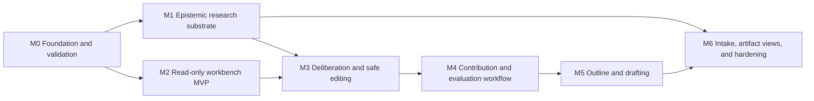

# RKA Roadmap

This roadmap turns the detailed [epistemic pipeline and manuscript workbench
plan](docs/superpowers/plans/2026-08-14-rka-epistemic-pipeline-and-manuscript-workbench.md)
into implementation milestones. It combines the ARA-inspired research-artifact
substrate with a researcher-facing manuscript drafting workbench.

The M0 authority, stage, proposal, and provider decisions are recorded in
[ADR 0001](docs/adr/0001-manuscript-workbench-authority-stage-and-ai-boundary.md).
The M1 interpretation boundary is recorded in
[ADR 0002](docs/adr/0002-interpretation-staging-and-experiment-boundary.md).
The canonical-claim applicability boundary is recorded in
[ADR 0003](docs/adr/0003-canonical-claim-scope-contracts.md).
The experiment/run/observation and exact-locator boundary is recorded in
[ADR 0004](docs/adr/0004-experiment-run-observation-and-evidence-locator-contracts.md).
The provisional planning and frozen-branch boundary is recorded in
[ADR 0005](docs/adr/0005-versioned-manuscript-planning-branches.md).
The unified human/AI proposal, conflict, and provider boundary is recorded in
[ADR 0006](docs/adr/0006-unified-semantic-patch-proposals.md).
The seed-to-contribution guidance, candidate identity, promotion, and exact PI
ratification boundary is recorded in
[ADR 0007](docs/adr/0007-seed-to-contribution-guidance-and-promotion.md).
The claim-centered evaluation, adverse-outcome, mission, and result-unit
boundary is recorded in
[ADR 0008](docs/adr/0008-claim-centered-evaluation-contract-and-results-trace.md).

The roadmap is ordered by dependency, not by invented delivery dates. Every
milestone must satisfy its exit gate before dependent work is treated as ready.

## Now

**M0 through M3 and M4 / PR 7 are complete on `main`. M4 / PR 8 (issue #59),
the evaluation contract and results trace, has satisfied its feature-branch
release gate.** PR [#78](https://github.com/infinitywings/rka/pull/78) merged
the seed-through-contribution dependency; ADR 0008 freezes the evaluation
contract, and the exact release evidence is recorded in
[`2026-08-15-workbench-m4-pr8-exit-evidence.md`](docs/superpowers/specs/2026-08-15-workbench-m4-pr8-exit-evidence.md).
Review and merge PR 8 before starting M4 / PR 9 progressive outline authoring.
The choice-first Writer delta is reconciled, the authority and AI boundary is
recorded in ADR 0001, the read-only workbench has passed its real-project exit
gate, and first-class experiment/run/observation/evidence-locator semantics
have passed their migration, REST/MCP, pack, deletion, change-impact, and
release gates.

The walkthrough and its design revisions are recorded in
[`2026-08-14-delaysteer-workbench-walkthrough.md`](docs/superpowers/specs/2026-08-14-delaysteer-workbench-walkthrough.md).
The authority and stage contracts have researcher approval. PR 1 now includes
the candidate schema and immutable audit history, exact source locators,
duplicate/conflict hints, explicit promotion and revocation, deterministic
review UI, REST/MCP/knowledge-pack parity, a full-suite release gate, an
isolated Docker smoke test, and a disposable DelaySteer browser pilot. PR 2
adds immutable canonical scope revisions, typed applicability conditions,
explicit extension and falsifier policy, independent scope/evidence/source/
contradiction axes, stale-content detection, fail-closed Writer eligibility,
and complete REST/MCP/pack/graph/workbench projections. Its release gate passed
the full Python suite, production web build, isolated container smoke test,
revision-conflict check, and browser walkthrough of missing, incomplete, ready,
and stale states.

This PR 4 slice projects interpretation and scope readiness in the Context Capsule,
stores workbench stage and review selection in shareable URLs, and provides
direct evidence-to-scope/source/interpretation trace exits. Its release gate
covers deep links, Back recovery, mismatched filter recovery, independent
epistemic labels, and browser console health. The evidence is recorded in
[`2026-08-14-workbench-scope-navigation-walkthrough.md`](docs/superpowers/specs/2026-08-14-workbench-scope-navigation-walkthrough.md).

The real-project admission pass now covers DelaySteer, InvarLLM, CPSEval, and
detectability through an online database backup. Project isolation passed, and
the workbench correctly refused to invent scopes or spines: the first two
projects have no native manuscript, while CPSEval and detectability have native
manuscripts but empty spines; all four still contain only legacy claims with
missing canonical scopes. The bounded positive path is now complete on a
disposable CPSEval database copy: one legacy method claim received an exact
reviewed scope and a one-claim native spine while remaining visibly unverified,
unassessed, unratified, and checkpoint-blocked. The pilot also exposed and
closed a narrow-viewport navigation defect. The evidence is recorded in
[`2026-08-15-cpseval-m2-positive-path.md`](docs/superpowers/specs/2026-08-15-cpseval-m2-positive-path.md).
No live semantic record changed. The final M2 pass adds explicit project-only,
loading, unavailable, empty, and capped-count states; keyboard stage
navigation; a skip link; live-region semantics; and a responsive 390 by 844
check. The evidence is recorded in
[`2026-08-15-workbench-m2-exit-evidence.md`](docs/superpowers/specs/2026-08-15-workbench-m2-exit-evidence.md).
The **M3 / PR 5 implementation** now satisfies its release gate. ADR 0005
freezes the authority, branch, version, and provenance contract. This slice adds
project-only and manuscript-bound planning, frozen copy-on-write ancestry,
typed immutable stage versions, exact evidence/context bindings, deterministic
resume and comparison, parking, pack/delete/change-cursor parity, and a
provisional workbench branch surface. It does not promote planning into
canonical manuscript semantics and does not yet add the PR 6 AI broker or
unified proposal/apply path. Its validation record is
[`2026-08-15-workbench-m3-pr5-exit-evidence.md`](docs/superpowers/specs/2026-08-15-workbench-m3-pr5-exit-evidence.md).
The **M3 / PR 6 implementation** has satisfied its feature-branch release gate.
ADR 0006 freezes one immutable proposal envelope for human, host-agent, and
local LM suggestions; explicit apply/reject/supersede; transactional stale-base
conflicts; exact context manifests and provider-call events; and REST, MCP,
workbench, knowledge-pack, deletion, and change-cursor parity. No proposal
mutates its target before an explicit apply, and AI proposals fail closed when
they exceed their disclosed target, evidence, or revision boundary. The
validation record is
[`2026-08-15-workbench-m3-pr6-exit-evidence.md`](docs/superpowers/specs/2026-08-15-workbench-m3-pr6-exit-evidence.md).
PR 6 merged in [#77](https://github.com/infinitywings/rka/pull/77). ADR 0007
now freezes the PR 7 stage, candidate-identity, promotion-ledger,
semantic-proposal, and exact PI-ratification contract. PR 7 now implements that
contract and has passed fresh-database plus disposable Invarllm browser gates,
including exact upstream invalidation, RQ promotion, contribution proposal and
application, exact-text PI ratification, and restart/resume. The validation
record is
[`2026-08-15-workbench-m4-pr7-exit-evidence.md`](docs/superpowers/specs/2026-08-15-workbench-m4-pr7-exit-evidence.md).

## Dependency map

M1 and M2 may proceed in parallel after M0. M2 must label missing experiment
semantics rather than pretending that M1 is already complete.

## Milestones

| Order | Milestone | Outcome | Planned work items | Exit gate |
|---|---|---|---|---|
| **M0** | **Foundation and validation** | Reconcile the existing Writer behavior and validate the proposed workbench before schema work. | PR 0A Writer delta reconciliation; PR 0B ADRs and read-only UX prototype; DelaySteer walkthrough. | A researcher can walk through the interface with a real RKA project, trace every displayed item to its source, and approve the authority and stage contracts. |
| **M1** | **Epistemic research substrate** | Convert noisy journal material into reviewable candidates and bounded evidence without overstating conclusions. | PR 1 Interpretation Staging; PR 2 claim scope contracts; PR 3 experiments, runs, results, and evidence locators. | Candidate-to-claim promotion is explicit and reversible; claims carry scope and falsifier information; positive, negative, and inconclusive results remain traceable and project-isolated. |
| **M2** | **Read-only manuscript workbench MVP** | Make the current argument and evidence navigable before enabling mutation. | PR 4 workbench shell and Context Capsule. | A researcher can inspect the sentence/paragraph spine, RQs, clusters, claims, sources, manuscript units, evidence, trace paths, and stale-impact warnings without changing canonical state. |
| **M3** | **Deliberation and safe editing** | Support resumable human/AI collaboration with one auditable mutation path. | PR 5 versioned planning artifacts and branches; PR 6 unified human/AI patch proposals and local-model adapter. | Direct edits and AI proposals use the same semantic diff, validation, conflict, apply/reject, and provenance path; no ratified semantics are silently overwritten. |
| **M4** | **Contribution and evaluation workflow** | Guide the researcher from framing through bounded contributions and testable evaluation commitments. | PR 7 seed-through-contribution workflow; PR 8 evaluation contract and results trace. | Problem, gap, insight, challenges, innovations, RQs, contributions, and evaluation commitments are linked; PI ratification is explicit; missing evidence becomes visible work. |
| **M5** | **Outline and drafting** | Turn the ratified spine into an expandable, evidence-linked manuscript. | PR 9 progressive outline and unit editor; PR 10 draft editor and source synchronization. | The researcher can expand and condense claim-sized units, draft in Markdown/LaTeX, navigate provenance, and apply conflict-safe writes without automatic Git operations. |
| **M6** | **Intake, artifact views, and hardening** | Complete source intake, deterministic ARA-inspired views, grounded foresight, and production-quality reliability. | PR 11 Source Inbox; PR 12A artifact profile and deterministic viewer; PR 12B grounded research foresight; PR 13 end-to-end reliability and usability. | Imported sources are safe and traceable; projections are deterministic rather than authoritative; foresight is advisory; real-project, security, accessibility, migration, and concurrency suites pass. |

## Tracking convention

- One GitHub milestone corresponds to each roadmap milestone above.
- One GitHub issue corresponds to each planned PR-sized work item.
- The single issue labeled `priority: next` is the immediate implementation
  target. Move that label only when its exit criteria are satisfied or the
  dependency order is explicitly revised.
- Use `roadmap` on every roadmap issue and `area: writer`, `area: substrate`,
  `area: workbench`, or `area: artifact` to make the work scannable.
- An issue is complete only when its acceptance criteria and required tests are
  satisfied. A rendered UI, an LLM response, or green unit tests alone do not
  establish workflow correctness.

## Cross-cutting constraints

- RKA remains the semantic authority; workbench and ARA-style views are
  projections over native RKA objects.
- Evidence, interpretation, PI ratification, AI suggestion, and public prose
  remain distinct.
- No journal entry becomes a claim automatically. Promotion must preserve the
  exact source locator and decision lineage.
- Negative, inconclusive, conflicting, and superseded evidence remains visible
  in the private reasoning substrate.
- Human and AI edits follow the same versioned proposal and validation path.
- External content is untrusted input: preview and hash it, never execute it or
  obey embedded instructions.
- Readiness is categorical (`Ready`, `Needs review`, `Blocked`, or
  `Exploratory`), never a paper score or acceptance prediction.

## First useful release

The first useful release spans M0–M5. It is reached when a researcher can start
with an insight, develop and ratify a traceable paper spine, connect it to
claims and evaluation evidence, produce a claim-sized outline, and expand a
unit into evidence-bounded draft prose through a recoverable, conflict-safe
workflow. M6 then completes intake, exchange/viewer capabilities, grounded
foresight, and operational hardening.

The detailed design, data model, UI behavior, API/MCP surface, tests, and full
acceptance criteria remain in the linked implementation plan and are normative
for the corresponding roadmap issues.
