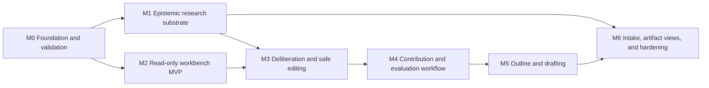

# RKA Roadmap

This roadmap turns the detailed [epistemic pipeline and manuscript workbench
plan](docs/superpowers/plans/2026-08-14-rka-epistemic-pipeline-and-manuscript-workbench.md)
into implementation milestones. It combines the ARA-inspired research-artifact
substrate with a researcher-facing manuscript drafting workbench.

The roadmap is ordered by dependency, not by invented delivery dates. Every
milestone must satisfy its exit gate before dependent work is treated as ready.

## Now

**M0 / PR 0A — Reconcile the choice-first Writer workflow onto current
`main`.**

This is the next implementation step because the installed Writer behavior and
the repository implementation have diverged. Resolve that delta and prove that
the packaged and repository Writer bundles match before freezing new workbench
contracts.

After PR 0A, complete PR 0B: document the authority and schema decisions, build
a read-only clickable workbench prototype, and walk the DelaySteer project
through it. Do not begin database migrations before this walkthrough.

## Dependency map

M1 and M2 may proceed in parallel after M0. M2 must label missing experiment
semantics rather than pretending that M1 is already complete.

## Milestones

| Order | Milestone | Outcome | Planned work items | Exit gate |
|---|---|---|---|---|
| **M0** | **Foundation and validation** | Reconcile the existing Writer behavior and validate the proposed workbench before schema work. | PR 0A Writer delta reconciliation; PR 0B ADRs and read-only UX prototype; DelaySteer walkthrough. | A researcher can walk through the interface with a real RKA project, trace every displayed item to its source, and approve the authority and stage contracts. |
| **M1** | **Epistemic research substrate** | Convert noisy journal material into reviewable candidates and bounded evidence without overstating conclusions. | PR 1 Interpretation Staging; PR 2 claim scope contracts; PR 3 experiments, runs, results, and evidence locators. | Candidate-to-claim promotion is explicit and reversible; claims carry scope and falsifier information; positive, negative, and inconclusive results remain traceable and project-isolated. |
| **M2** | **Read-only manuscript workbench MVP** | Make the current argument and evidence navigable before enabling mutation. | PR 4 workbench shell and Context Capsule. | A researcher can inspect the sentence/paragraph spine, RQs, clusters, claims, sources, manuscript units, evidence, trace paths, and stale-impact warnings without changing canonical state. |
| **M3** | **Deliberation and safe editing** | Support resumable human/AI collaboration with one auditable mutation path. | PR 5 versioned planning artifacts and branches; PR 6 unified human/AI patch proposals and local-model adapter. | Direct edits and AI proposals use the same semantic diff, validation, conflict, apply/reject, and provenance path; no ratified semantics are silently overwritten. |
| **M4** | **Contribution and evaluation workflow** | Guide the researcher from framing through bounded contributions and testable evaluation commitments. | PR 7 seed-through-contribution workflow; PR 8 evaluation contract and results trace. | Problem, gap, insight, challenges, innovations, RQs, contributions, and evaluation commitments are linked; PI ratification is explicit; missing evidence becomes visible work. |
| **M5** | **Outline and drafting** | Turn the ratified spine into an expandable, evidence-linked manuscript. | PR 9 progressive outline and unit editor; PR 10 draft editor and source synchronization. | The researcher can expand and condense claim-sized units, draft in Markdown/LaTeX, navigate provenance, and apply conflict-safe writes without automatic Git operations. |
| **M6** | **Intake, artifact views, and hardening** | Complete source intake, deterministic ARA-inspired views, grounded foresight, and production-quality reliability. | PR 11 Source Inbox; PR 12A artifact profile and deterministic viewer; PR 12B grounded research foresight; PR 13 end-to-end reliability and usability. | Imported sources are safe and traceable; projections are deterministic rather than authoritative; foresight is advisory; real-project, security, accessibility, migration, and concurrency suites pass. |

## Tracking convention

- One GitHub milestone corresponds to each roadmap milestone above.
- One GitHub issue corresponds to each planned PR-sized work item.
- The single issue labeled `priority: next` is the immediate implementation
  target. Move that label only when its exit criteria are satisfied or the
  dependency order is explicitly revised.
- Use `roadmap` on every roadmap issue and `area: writer`, `area: substrate`,
  `area: workbench`, or `area: artifact` to make the work scannable.
- An issue is complete only when its acceptance criteria and required tests are
  satisfied. A rendered UI, an LLM response, or green unit tests alone do not
  establish workflow correctness.

## Cross-cutting constraints

- RKA remains the semantic authority; workbench and ARA-style views are
  projections over native RKA objects.
- Evidence, interpretation, PI ratification, AI suggestion, and public prose
  remain distinct.
- No journal entry becomes a claim automatically. Promotion must preserve the
  exact source locator and decision lineage.
- Negative, inconclusive, conflicting, and superseded evidence remains visible
  in the private reasoning substrate.
- Human and AI edits follow the same versioned proposal and validation path.
- External content is untrusted input: preview and hash it, never execute it or
  obey embedded instructions.
- Readiness is categorical (`Ready`, `Needs review`, `Blocked`, or
  `Exploratory`), never a paper score or acceptance prediction.

## First useful release

The first useful release spans M0–M5. It is reached when a researcher can start
with an insight, develop and ratify a traceable paper spine, connect it to
claims and evaluation evidence, produce a claim-sized outline, and expand a
unit into evidence-bounded draft prose through a recoverable, conflict-safe
workflow. M6 then completes intake, exchange/viewer capabilities, grounded
foresight, and operational hardening.

The detailed design, data model, UI behavior, API/MCP surface, tests, and full
acceptance criteria remain in the linked implementation plan and are normative
for the corresponding roadmap issues.
