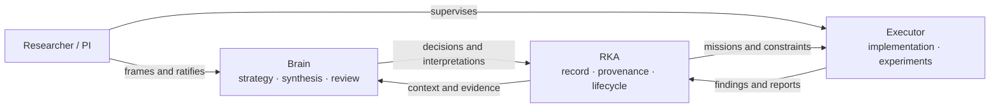
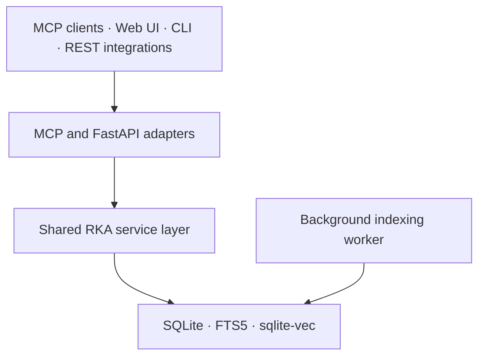

# RKA Architecture

This document explains the architectural boundaries behind RKA. For the product overview, start with the [README](../README.md). For commands and integration details, see the [Technical Reference](TECHNICAL_REFERENCE.md).

## Design objective

RKA is designed for long-running, AI-assisted research in which observations, decisions, experiments, and interpretations evolve across many sessions. Its central responsibility is to preserve a reconstructable chain from research activity to current knowledge without treating every transient note or model suggestion as established fact.

Five principles guide the design:

1. **Raw records persist.** Later reinterpretation must not erase the original observation, instruction, or result.
2. **Interpretations are revisable.** Claims, clusters, and research framing may be reviewed, superseded, or rebuilt.
3. **Provenance is explicit.** Decisions, missions, findings, claims, and sources are connected through typed relationships.
4. **Commitment is researcher-controlled.** AI collaborators may propose and execute, but consequential choices remain visible and ratifiable.
5. **Disagreement remains inspectable.** Contradictions, failed branches, stale beliefs, and unresolved assumptions are represented rather than flattened away.

## Researcher–Brain–Executor model

RKA separates three responsibilities:

- **Researcher / PI:** frames goals, contributes expertise, resolves ambiguity, and ratifies consequential choices.
- **Brain:** retrieves context, synthesizes evidence, maintains the research map, proposes decisions, and integrates Executor reports.
- **Executor:** performs bounded missions, runs experiments or implementation work, records findings, and raises checkpoints.

These are logical roles. The reference deployment commonly uses Claude Desktop or Claude Code, but the RKA core is exposed through MCP and REST rather than embedded in a particular model runtime.



## Runtime components

RKA uses a layered architecture:

1. **Client adapters** — MCP, REST, CLI, and the web dashboard accept requests and translate them into service calls.
2. **Service layer** — business logic for projects, journals, decisions, literature, missions, claims, evidence clusters, research maps, freshness, search, and export.
3. **Persistence and retrieval** — SQLite stores structured state and audit history; FTS5 and optional sqlite-vec indexes support retrieval.
4. **Background worker** — processes indexing and embedding jobs without blocking interactive requests.



API routes and MCP tools are thin adapters. Core business rules belong in `rka/services/` so behavior remains consistent across interfaces.

## Knowledge layers

RKA separates the durable activity record from interpretations built over it.

### Activity layer

- Journal entries capture notes, procedures, and directives.
- Literature entries capture external sources and reading state.
- Decisions record questions, alternatives, chosen paths, rationale, and assumptions.
- Missions define bounded work with acceptance criteria and escalation triggers.
- Reports and checkpoints preserve execution outcomes and unresolved choices.

### Interpretation layer

- Claims represent atomic hypotheses, evidence, methods, results, observations, or assumptions.
- Evidence clusters group related claims and carry a reviewed synthesis.
- Research questions organize clusters into a research map.
- Freshness state identifies knowledge affected by superseded sources or invalidated assumptions.

### Downstream publication layer (separate project)

The standalone [`rka-writer`](https://github.com/infinitywings/rka-writer)
project can use claims, clusters, research questions, literature, decisions,
and evidence through Core's public contract to construct a claim spine and
draft. Its manuscript workbench is a separately installed editing and audit
surface. Core neither bundles nor auto-activates writing instructions, so
clients that only need research records and retrieval remain unaffected by
Writer behavior.

## Provenance graph

Typed entity links connect the research lifecycle. Common relationships include:

- literature **informed** a decision;
- a decision **motivated** a mission;
- a mission **produced** a journal finding;
- a claim was **derived from** a source entry;
- one claim **supports**, **qualifies**, or **contradicts** another;
- newer knowledge **supersedes** an older decision or claim.

Because the graph preserves both upstream sources and downstream dependents, RKA can answer provenance questions and propagate staleness when foundational assumptions change.

## Progressive crystallization

Research notes are noisy by design. RKA therefore uses staged promotion rather than immediate formalization:

```text
journal activity
    -> candidate claims
    -> reviewed claims
    -> evidence clusters
    -> research questions and gaps
    -> claim spine and evaluation obligations
    -> manuscript or interoperable artifact
```

Promotion requires stronger evidence and review as material moves downstream. Low-value repetition can be consolidated without deleting the underlying record. Contradictions and negative results remain available even when they are not included in public manuscript prose.

## Decisions, missions, and control

A typical cycle is:

1. The researcher frames a goal.
2. The Brain retrieves relevant context and presents a confirmation brief or decision options.
3. The researcher ratifies the direction.
4. The Brain creates a bounded mission linked to the motivating decision.
5. The Executor performs the work and records findings.
6. The Executor raises checkpoints when scope, assumptions, or evidence require judgment.
7. The Brain integrates the report, updates affected knowledge, and opens the next decision cycle.

This model keeps implementation velocity separate from the authority to redefine the research question or claim success.

## Search and context

RKA combines lexical retrieval, optional semantic retrieval, and graph structure:

- FTS5 provides exact and phrase-sensitive retrieval.
- sqlite-vec provides optional local or configured embedding search.
- Reciprocal-rank fusion combines lexical and semantic candidates.
- Importance, graph centrality, and recency provide deterministic context ordering.
- Multi-hop retrieval follows typed relationships when an answer depends on connected entities rather than text similarity alone.

The storage layer does not make research judgments. Connected AI clients interpret retrieved material under the role skills and write structured outcomes back through validated operations.

## MCP surface

The default MCP interface exposes a compact dispatch surface rather than broadcasting every operation as a separate tool:

- `rka_query` for reads;
- `rka_execute` for writes and lifecycle transitions;
- `rka_describe` for operation schemas;
- `rka_load_tools` and `rka_help` as compatibility and discovery paths.

Each dispatched operation has a typed argument model with operation-specific required fields and enums. `rka_describe` is the authoritative runtime catalog; this avoids maintaining a brittle duplicate list in the README.

## Local-first boundary

The core database and dashboard run locally. Embeddings may remain fully local or use a configured compatible backend. MCP stdio also remains local. Remote access must be mediated through an authenticated connector; the raw HTTP MCP port should not be exposed directly.

See [ChatGPT Connector](CHATGPT_CONNECTOR.md) for the supported authenticated remote path and [Credential Vault](CRED_VAULT.md) for secret handling.

## Extension boundaries

When adding a capability:

1. define or update the typed model;
2. place business logic in the service layer;
3. expose thin REST and MCP adapters;
4. preserve explicit project scoping and actor attribution;
5. create provenance links for derived or motivating entities;
6. cover both service semantics and exported/serialized behavior in tests.

Contributor-specific commands and conventions are maintained in [`CLAUDE.md`](../CLAUDE.md).
