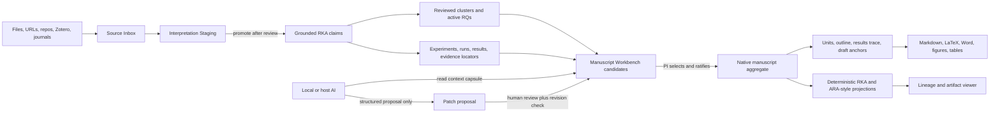

# RKA Epistemic Pipeline and Manuscript Drafting Workbench

Status: roadmap design source; M0, M1, and M2 are complete on `main`. M3 PR 5
versioned planning artifacts and branches is implementation-complete and
release-validated on its feature branch; PR 6 follows after review and merge.

Date: 2026-08-14

Roadmap: [`ROADMAP.md`](../../../ROADMAP.md). The roadmap defines milestone
order and the immediate implementation target; this document remains the
normative detailed design and acceptance-criteria source.

M0 authority, stage, proposal, and AI-provider decisions are frozen in
[`ADR 0001`](../../adr/0001-manuscript-workbench-authority-stage-and-ai-boundary.md).
The real-project validation and resulting design revisions are recorded in the
[`M0 walkthrough`](../specs/2026-08-14-delaysteer-workbench-walkthrough.md).
The M1 interpretation and experiment boundary is frozen in
[`ADR 0002`](../../adr/0002-interpretation-staging-and-experiment-boundary.md).
The M1 canonical-claim applicability boundary is frozen in
[`ADR 0003`](../../adr/0003-canonical-claim-scope-contracts.md).
The M1 experiment/run/observation and exact-locator boundary is frozen in
[`ADR 0004`](../../adr/0004-experiment-run-observation-and-evidence-locator-contracts.md).
The M3 provisional-planning and frozen-branch boundary is frozen in
[`ADR 0005`](../../adr/0005-versioned-manuscript-planning-branches.md).
The PR 5 release evidence is recorded in the
[`M3 planning-branch exit record`](../specs/2026-08-15-workbench-m3-pr5-exit-evidence.md).

## 1. Baseline and source snapshots

This plan targets the clean default RKA branch at:

- repository: `infinitywings/rka`
- branch: `main`
- current implementation baseline: `ba687721b9632a4a12c864100d9690ca428ac005`
- original plan baseline: `edb1e6f170025a77ddcb5b89038d0e1a34af4857`
- RKA package version: `2.9.0`
- latest migration on baseline: `042`

The Writer behavior had a relevant delta that the local M0 implementation now
reconciles onto the current baseline:

- remote branch: `origin/codex/writer-framing-elicitation`
- commit: `a00bc8b77511d7dae3676cbcc3cf5e04b78eee5a`
- installed personal Writer metadata: `2.7.2`
- key addition: choice-first framing and resumable `FRAMING_SESSION.yaml`

The implementation ports the choice-first behavior rather than assuming that
the installed plugin is part of RKA `main`. Repository and plugin mirrors are
tested together.

External design inputs inspected for this plan:

- [PaperSpine](https://github.com/WUBING2023/PaperSpine), commit
  `66dfbf0d620e00735274ce699eaf93ab4518da1e`, version 4.0 design.
- [Agent-Native Research Artifact](https://github.com/ARA-Labs/Agent-Native-Research-Artifact),
  commit `9c52a3cf432bc6d4d30ca88e7fe2189f32470d58`.
- [ARA CLI and deterministic viewer](https://github.com/ARA-Labs/ara-cli),
  commit `5201910ffa7055c39c53b728617913cee1379a26`.
- [STORM and Co-STORM](https://github.com/stanford-oval/storm), especially
  collaborative discourse, perspective-guided questions, and an evolving
  shared concept map.
- [PaperQA](https://github.com/Future-House/paper-qa), especially iterative
  question-specific retrieval and evidence contexts over local literature.

## 2. Executive design decision

Build the manuscript workbench as a **reversible argument studio over RKA's
native manuscript aggregate**, not as a chat page, a rigid wizard, a directory
of generated Markdown files, or a second knowledge base.

The workbench should provide three synchronized capabilities:

1. **Guided argument construction.** Help the researcher move from a seed
   insight to a paragraph spine, problem and gap, mechanism, innovations,
   research questions, contribution contract, evaluation contract, outline,
   and draft.
2. **Auditable navigation.** Let the researcher move in both directions through
   `source -> journal -> claim -> cluster -> RQ -> manuscript claim -> unit ->
   prose`, including qualifiers, counterevidence, dead ends, decisions, and
   superseded alternatives.
3. **Safe collaborative editing.** Let a human directly edit or ask AI to
   explain, compare, critique, expand, or propose changes. Human and AI edits
   must use the same versioned proposal and validation path. Neither may
   silently overwrite ratified semantics.

The recommended interaction model is **guided but non-linear**. A stage rail
suggests the next useful decision, while the researcher can jump, branch,
compare alternatives, return upstream, or park an unresolved issue. Readiness
is categorical (`Ready`, `Needs review`, `Blocked`, `Exploratory`), never a
numeric paper score or predicted acceptance probability.

## 3. Goals

The workbench should:

- reduce blank-page pressure by proposing evidence-bounded choices;
- preserve the researcher's control over framing, contribution strength, and
  final wording;
- convert noisy research history into a visible, reviewable argument;
- allow direct editing and AI-assisted editing without creating two workflows;
- make every substantive manuscript promise traceable to current RKA evidence;
- distinguish author intent, scientific evidence, PI ratification, AI
  suggestion, and rendered prose;
- support local files, URLs, repositories, Zotero records, and existing RKA
  records as source inputs;
- preserve negative results, dead ends, qualifiers, contradictions, and
  superseded choices without forcing all private risk material into public
  prose;
- support persuasive, quick-reader-friendly writing within the evidence and
  disclosure boundary;
- resume after interruption without replaying completed work;
- work with the configured local LLM, including LM Studio, while permitting a
  host agent such as Codex or Claude to use the same proposal API;
- provide deterministic projections and review views that never become the
  semantic authority.

## 4. Non-goals

The first versions should not:

- autonomously write and ratify a paper end to end;
- treat a fluent AI synthesis as scientific evidence;
- convert every journal entry into a claim;
- replace RKA's native `man_`, `mcl_`, `mun_`, decision, evidence, checkpoint,
  readiness, or change-cursor semantics;
- let users hand-edit `RKA_CLAIM_SPINE.yaml` and mistake that for a server
  update;
- use fixed contribution counts, section counts, citation quotas, or IMRaD as
  universal correctness criteria;
- treat structural completeness as proof of scientific validity;
- execute imported repository code or obey instructions embedded in an
  imported document;
- send research material to an external model without a visible context
  manifest and explicit provider boundary;
- make commits, push changes, or submit a manuscript automatically.

## 5. What to borrow, adapt, and reject

### 5.1 From the existing RKA Writer

Keep as hard architectural invariants:

- RKA is authoritative for manuscript identity, exact claim wording and
  versions, evidence roles, PI decisions and ratifications, units,
  checkpoints, readiness, and semantic change impact.
- A `dec_` can authorize wording but cannot supply empirical support.
- An `ecl_` can guide synthesis and discovery but cannot replace terminal
  evidence.
- Support, qualifiers, and counterevidence remain separate roles.
- Claim wording changes append versions and require new exact PI ratification.
- Semantic updates use an expected manuscript revision and never retry a
  conflict blindly.
- Generated claim-spine and planning files are read-only projections.
- Public prose is a selective projection of a complete internal record.
- Material limitations and claim-changing negative results remain visible in
  the correct public location; speculative and immaterial internal weaknesses
  need not be volunteered.
- The quick-reader path should expose problem, insight, contribution, strongest
  evidence, and boundary without requiring specialist-level effort.

Port from the Writer framing feature branch:

- one decision per interaction;
- two to four genuine evidence-bounded choices;
- explicit single-select or multi-select mode;
- pros, cons, evidence, risk, and paper-level effect on every option;
- a recommendation only when justified;
- `revise/combine` and `defer/gather evidence` paths;
- advisory micro-selections until a final PI confirmation;
- resumable framing state rather than restarting the interview.

The workbench should make this interaction model visual and persistent, rather
than relying on a YAML file and a sequence of chat turns.

### 5.2 From PaperSpine

Borrow:

- contribution-first planning;
- the Introduction argument ladder: problem, progress, gap, RQ, response,
  evidence preview, reader payoff;
- a SOTA-gap map that distinguishes what prior work does, what the project has,
  the real gap, and the risk in the proposed claim;
- a writing-rationale matrix at paragraph- or claim-sized granularity;
- results-as-validation: every major result tests a manuscript promise and has
  an allowed and prohibited interpretation;
- local-first material inventory;
- stage resume and explicit completion artifacts;
- reviewer-aware checks before declaring a manuscript ready.

Adapt:

- `confirmed_contribution.md` becomes a workbench candidate artifact and then
  native `mcl_` versions plus PI ratifications.
- `writing_rationale_matrix.md` becomes a view over `mun_` units, claim links,
  evidence bindings, rhetorical jobs, and final text checks.
- `results_validation.md` becomes a view over native result units and the
  future experiment/run/result substrate.
- `sota_gap_map.md` becomes a literature landscape stage artifact whose claims
  resolve to verified `lit_` and `clm_` records.
- stage gates become dependency-sensitive RKA readiness checks, not file
  existence checks.

Reject:

- hard-coded citation counts or recent-paper percentages as universal quality
  gates;
- fixed stage or section counts as proof of completeness;
- wording such as "we proved each thing we claimed" when the evidence only
  supports, partially supports, or fails to support a bounded claim;
- Markdown artifacts as the canonical state;
- a mandatory linear route that prevents legitimate iteration;
- any generated rationale matrix row that has no RKA evidence or explicit
  author-intent classification.

### 5.3 From ARA and ara-cli

Borrow:

- progressive disclosure: a compact context capsule first, then deeper records
  on demand;
- cross-layer bindings between claims, decisions, experiments, evidence,
  source code, and manuscript units;
- first-class dead ends and rejected alternatives;
- actor provenance such as user, AI-suggested, AI-executed, and user-revised;
- a deterministic, local-first viewer that renders structured source without
  an LLM at view time;
- accessible tree and graph views with a synchronized detail pane;
- live reload while preserving selection and navigation state;
- validation and linting that are distinct from generation;
- grounded foresight that distinguishes supported next steps, speculative
  possibilities, and paths ruled out by negative evidence.

Adapt:

- ARA files should be an export profile, not RKA's internal authority.
- The ARA exploration tree should be projected from RKA's journal, decisions,
  missions, experiments, results, and links.
- `PAPER.md` inspires a compact Workbench Context Capsule but does not replace
  RKA queries.
- The deterministic ARA viewer patterns should inform the evidence and lineage
  explorer inside the workbench.

Reject:

- claims that execution traces alone establish truth;
- a static folder schema as the primary mutable store;
- a generic DAG that loses RKA's typed evidence, currency, project isolation,
  ratification, and optimistic-revision rules;
- view-time AI narration that can drift from the structured state.

### 5.4 From Co-STORM and PaperQA

Borrow from Co-STORM:

- a shared, evolving concept map during long discussions;
- a turn policy that lets the AI answer, ask a useful question, or suggest a
  new branch rather than always generating prose;
- user steering during research and framing;
- perspective-guided questions to expose missing literature or assumptions;
- a warm-start view that builds common ground before detailed drafting.

Borrow from PaperQA:

- iterative, question-specific evidence gathering rather than one large
  one-shot query;
- local document indexing and re-use;
- evidence contexts scored for relevance to the current question;
- citations tied to the evidence snippets used in an answer;
- query reformulation and multi-angle retrieval.

Do not treat simulated experts, retrieved snippets, relevance scores, or AI
answers as accepted RKA claims. They remain context until admitted through the
normal evidence pipeline.

## 6. The combined architecture

The ARA-inspired research substrate and the manuscript workbench should be two
tracks over one semantic core.



The workbench is not an alternate path around the graph. It is a focused
editor and discussion surface for turning the graph into a paper.

## 7. Interface concept

### 7.1 Main layout

Use a resizable four-surface layout:

```text
+--------------------------------------------------------------------------------+
| Manuscript | branch | venue | phase | RKA cursor | readiness | model/provider  |
+------------------+--------------------------------------+----------------------+
| Stage and source | Argument canvas                      | AI collaborator      |
| navigator        |                                      |                      |
|                  | sentence / paragraph / graph /       | discuss selection    |
| Seed             | evaluation matrix / outline / draft  | propose alternatives |
| Spine            |                                      | critique / trace     |
| Problem          | direct editing and structured cards  | generate patch       |
| Landscape        |                                      |                      |
| Response         |                                      |                      |
| RQs ...          |                                      |                      |
+------------------+--------------------------------------+----------------------+
| Evidence, provenance, contradictions, source preview, and proposed diff        |
+--------------------------------------------------------------------------------+
```

Recommended behavior:

- **Left navigator:** guided stage rail, Source Inbox, unresolved parking lot,
  branches, and recently changed RKA records.
- **Center canvas:** changes with the selected stage. Early stages use cards
  and an argument graph. Later stages use an evaluation matrix, hierarchical
  outline, and Markdown/LaTeX source editor.
- **Right collaborator:** discussion scoped to the selected object and stage,
  with explicit actions such as `Explain`, `Compare`, `Stress-test`,
  `Find evidence`, `Propose alternatives`, `Expand one level`, and `Draft
  patch`.
- **Bottom inspector:** evidence roles, exact source locators, status/currency,
  contradictions, decisions, lineage, and semantic/file diffs.

The layout should support split and stack modes, keyboard selection, persistent
panel ratios, and a single-column small-screen fallback. Node kinds must use
text and glyphs, not color alone.

### 7.2 Workbench modes

Provide four modes over the same objects:

1. **Guided:** the recommended route for a new manuscript. It shows one
   decision at a time and proposes bounded alternatives.
2. **Canvas:** free navigation and direct editing of the argument map.
3. **Revision:** load an existing manuscript, compare its visible promises to
   RKA evidence, and repair the spine or outline.
4. **Evidence audit:** inspect claim coverage, qualifiers, contradictions,
   stale dependencies, orphan results, and unsupported prose without
   generating new prose.

Mode changes affect presentation, not authority or stored semantics.

### 7.3 Progressive elaboration levels

The researcher should be able to collapse or expand the paper at these levels:

- L0: one-sentence insight;
- L1: one-paragraph paper spine;
- L2: problem, landscape/gap, response, challenge, RQ, contribution, evidence;
- L3: section skeleton and section communicative jobs;
- L4: claim-sized or paragraph-sized manuscript units;
- L5: evidence bullets, transitions, figures, tables, and citation intentions;
- L6: draft prose;
- L7: polished, venue-adapted manuscript.

Every expansion preserves lineage to its parent representation. A user can
collapse a 30-page draft back to the paragraph spine to check whether the
argument still matches the paper's promise.

## 8. Guided drafting stages

The stages below are the recommended route, not a locked wizard. Each stage
has a goal, structured output, evidence view, unresolved-items view, and an
explicit next-action recommendation.

| Stage | Main researcher question | Primary output | RKA mapping |
|---|---|---|---|
| 0. Intake and context | What project, manuscript, venue, audience, and source material are in scope? | Context Capsule and Source Inbox | `prj_`, `man_`, venue, workspace, source records |
| 1. Seed insight | What is the smallest non-obvious idea worth testing or explaining? | One-sentence Framing Seed | advisory planning artifact; author intent, not evidence |
| 2. Paragraph spine | Can the paper be understood as one coherent causal or argumentative paragraph? | Context/problem -> gap -> insight -> response -> evidence -> payoff paragraph | versioned framing artifact with RKA references |
| 3. Problem and scope | What exact problem is addressed, for whom, and under which conditions? | problem statement, threat/assumption boundary, excluded scope | candidate manuscript units and scope contract |
| 4. Literature and SOTA | What exists, what it achieves, and what remains unresolved? | landscape map, comparison axes, gap candidates, citation needs | verified `lit_`, source-grounded `clm_`, candidate stage artifact |
| 5. Gap and motivation | Which gap is real, material, and aligned with available evidence? | selected central gap, stakes, reader outcome | PI-selected framing; later `dec_` if formalized |
| 6. Insight and response | How does the core insight fill the gap? | mechanism or conceptual response with causal chain | method/theory candidate claim and design decisions |
| 7. Challenges and innovations | What makes the response difficult, and what innovation addresses each difficulty? | challenge -> innovation -> expected effect map; explored and rejected alternatives | decisions, missions, dead ends, claims, experiment needs |
| 8. RQs and contributions | What will the paper answer and what exact claims will it be judged on? | active RQs, smallest coherent contribution portfolio, allowed/prohibited wording | `dec_` RQs, native `mcl_` versions, PI ratifications |
| 9. Evaluation contract | What evidence would make each contribution credible, and what is available or missing? | claim -> test -> baseline -> metric -> condition -> result -> boundary matrix | future experiment/run/result records, `mun_` result units, artifacts |
| 10. Outline | What sequence makes the argument easiest to accept and verify? | hierarchical outline and unit rationale | `mun_`, claim-unit bindings, Outline checkpoint |
| 11. Draft | How should each unit be expanded without changing the licensed claim? | evidence bullets -> paragraph plan -> prose -> citations | workspace files, unit status, provenance comments |
| 12. Review and revision | Does the paper deliver the same bounded promise to a quick and expert reader? | reviewer-risk register, quick-reader audit, targeted patches | readiness, attestations, checkpoints, revision missions |

### 8.1 Framing Seed

The seed is not a claim and should not be forced to look like one. Store:

- the one-sentence insight;
- problem signal;
- mechanism intuition;
- expected effect;
- intended reader;
- initial boundary;
- evidence hints;
- origin: user, AI-suggested, imported, or user-revised;
- RKA records that inspired it;
- unresolved questions.

The AI may propose two to four seeds from current RKA material, but the user
may write or revise one directly. Selection remains advisory.

### 8.2 Paragraph spine

Default slots:

1. context and concrete problem;
2. progress and remaining gap;
3. core insight;
4. technical or conceptual response;
5. main challenge and innovation;
6. evidence or evaluation promise;
7. contribution and reader payoff.

Slots are optional and reorderable. A systems paper, empirical discovery,
survey, theory paper, and NSF proposal should not be forced into identical
sentences. The workbench should show both the paragraph and the underlying
slot cards so direct prose editing does not hide structural changes.

### 8.3 Landscape and gap

The landscape canvas should organize literature by defensible comparison
axes, not by a list of summaries. Each row or node should show:

- literature identity and current validation status;
- what the prior work actually claims;
- conditions and evidence cited for that claim;
- relationship to the current problem;
- capability provided;
- limitation relevant to this manuscript;
- whether the limitation is directly supported, inferred, or still a search
  question;
- candidate gap and novelty risk;
- exact passages or RKA claim IDs used.

The AI can propose missing perspectives and search questions. It cannot label
a gap as established until the literature evidence supports the
characterization.

### 8.4 Challenge and innovation map

Represent this as a small typed graph:

```text
gap -> technical/scientific challenge -> design insight -> innovation
    -> expected mechanism -> required evidence -> observed result -> boundary
```

Rejected alternatives and dead ends attach to the challenge they illuminate.
They remain visible to the researcher but appear in public prose only when
they explain a material design choice or reviewer defense.

### 8.5 RQ and contribution contract

For every proposed contribution show:

- contribution type;
- exact provisional wording;
- RQ addressed;
- positive evidence;
- qualifiers and counterevidence;
- tested conditions;
- strongest allowed wording;
- prohibited extensions;
- novelty and significance risk;
- intended manuscript units;
- missing evidence and recommended action.

The workbench should recommend the smallest coherent portfolio, normally two
to four contributions, but must not enforce a fixed count. Decorative,
redundant, or unsupported candidates should be parked rather than promoted.

Promotion to an active `mcl_` requires a revision-guarded native update and a
separate exact PI ratification. Editing a ratified claim creates a proposed new
version; it never edits the old version in place.

### 8.6 Evaluation contract

The evaluation canvas should be claim-centered:

| Contribution | RQ | Required evidence | Experiment/test | Baseline/control | Metric/observation | Conditions | Available evidence | Missing evidence | Allowed interpretation | Prohibited interpretation |
|---|---|---|---|---|---|---|---|---|---|---|

Each empirical contribution needs at least one result unit. Each major result
must test a contribution or be explicitly marked exploratory. `Supports`,
`partially supports`, `fails to support`, and `inconclusive` are acceptable
outcomes. A negative result must not be rewritten into a success, but it may
support a narrower or different contribution.

### 8.7 Outline and drafting

Each outline/unit card should include:

- communicative job;
- intended reader takeaway;
- claim IDs;
- evidence, qualifier, and counterevidence IDs;
- figure/table/citation intentions;
- allowed and prohibited interpretation;
- transition from the prior unit;
- quick-reader role;
- status and blocker.

`Expand one level` converts a unit into subunits, evidence bullets, or prose
without losing the parent. `Condense` reconstructs the higher-level argument
from the current lower-level content and reports any mismatch.

## 9. Evidence and logic substrate

### 9.1 Context Capsule

Every AI request and every stage load should use a compact, inspectable Context
Capsule containing only what is needed:

- explicit project and manuscript IDs;
- active branch and stage goal;
- current seed and paragraph spine;
- selected RQs and ratified contribution wording;
- relevant claim and unit summaries;
- evidence bundle with support, qualifier, and counterevidence roles;
- terminal source IDs and exact locators;
- recent semantic changes since the saved cursor;
- unresolved contradictions, stale items, and parked questions;
- venue and audience constraints;
- private/public treatment boundary for reviewer-sensitive concerns.

Build the evidence bundle with several short retrieval angles and graph
expansion. Show `included_via` to the user. A one-shot paragraph search is not
enough.

### 9.2 Evidence badges

Use categorical labels:

- Grounded / ungrounded;
- Supported / partially supported / unassessed / contradicted;
- Current / stale / superseded / retracted;
- Ratified / provisional;
- Direct evidence / qualifier / counterevidence / context / inspiration;
- User statement / AI suggestion / imported text / system inference.

Every badge must open the underlying record and lineage. Color is secondary to
text and glyphs.

### 9.3 Trace navigation

From any visible sentence, claim, result, or outline unit, the user should be
able to open:

```text
prose anchor
-> manuscript unit
-> manuscript claim version
-> support, qualifier, counterevidence
-> grounded RKA claim
-> exact source locator
-> journal, literature, artifact, experiment, or repository snapshot
```

The reverse route should answer: "Where would this evidence change affect the
paper?"

## 10. Source Inbox and external content

External content enters an inbox before it enters the research graph.

### 10.1 Supported sources

- local files and folders;
- PDF, DOCX, Markdown, LaTeX, BibTeX, RIS, CSV, JSON, images, and notebooks;
- pasted text;
- URLs;
- Git repositories and selected commits or paths;
- Zotero items and collections;
- existing RKA records and manuscript workspaces.

### 10.2 Ingestion flow

```text
add source -> scan safely -> preview manifest -> select scope
-> extract candidate observations and locators
-> classify source role -> deduplicate and detect conflicts
-> user triage -> promote to appropriate RKA records
```

Record:

- source type, title, origin, retrieval time, and content hash;
- local path or URL;
- repository remote, commit SHA, relative path, and dirty-state note;
- page, section, line, row, cell, JSON path, figure, or table locator;
- license/access note where relevant;
- extraction tool and version;
- prompt-injection and secret-scan warnings;
- selected disclosure scope for AI use.

### 10.3 Safety rules

- Treat imported prose and repository files as untrusted data, never as
  instructions.
- Do not execute imported code during indexing.
- Do not follow arbitrary URL chains or access local network addresses.
- Restrict file access to approved source and manuscript roots; reject path
  traversal and unsafe symlinks.
- Ignore common secret, credential, cache, model, binary, and dependency
  directories by default.
- Preview exactly which snippets will be sent to a model.
- Keep provider selection visible and task-aware. Require local inference for
  local-only material, and require an explicit context-disclosure confirmation
  before an external provider receives a new data scope.
- Do not automatically promote an extracted sentence into a supported claim.

## 11. AI interaction contract

### 11.1 Separation of discussion and mutation

The collaborator has three output classes:

1. **Discussion:** explanation, critique, comparison, question, or suggestion.
   It is not stored as evidence.
2. **Candidate artifact:** a branchable framing, landscape, challenge map,
   evaluation plan, or outline proposal. It is stored as provisional planning
   state.
3. **Semantic patch proposal:** a typed diff against native manuscript or
   research objects. It is never applied automatically.

Raw chat should be ephemeral by default. Provide explicit `Capture rationale`
or `Record decision` actions. This prevents conversational noise from becoming
research evidence.

### 11.2 Structured proposal envelope

Every proposed edit should include:

- proposal ID;
- project, manuscript, branch, and stage;
- base manuscript revision and planning-artifact version;
- operation list;
- before and after values;
- rationale;
- RKA evidence references by role;
- affected units and files;
- claim-strength change classification;
- new blockers or removed blockers;
- public/private boundary effects;
- model/provider and context-manifest hash;
- validation findings;
- status: proposed, applied, rejected, expired, or superseded.

The UI must show a semantic diff before application. Claim strengthening,
qualifier removal, counterevidence removal, scope broadening, or an edit to a
ratified version receives a high-visibility warning and requires the proper
new evidence or ratification path.

### 11.3 Human and AI parity

A direct edit and an AI edit use the same service rules:

- editing a provisional planning artifact appends a new version;
- editing native semantic state creates a proposal against an expected
  revision;
- editing ratified wording appends a new claim version;
- editing prose uses an expected content hash and atomic file replacement;
- changing a dependency invalidates affected checkpoints and readiness;
- conflicts open a rebase/compare screen instead of blind overwrite.

### 11.4 Turn policy

The AI should choose among:

- answer or explain;
- ask one high-value question;
- offer two to four bounded options;
- retrieve missing evidence;
- identify a contradiction or blocker;
- propose a branch;
- propose a patch;
- recommend deferral or an evidence mission.

It should not respond to every turn with a long draft. The stage goal and the
researcher's current selection determine the smallest useful action.

## 12. Persistence and authority model

### 12.1 Four layers

1. **Research evidence, canonical:** current RKA journals, literature, claims,
   clusters, RQs, decisions, artifacts, and future experiments/results.
2. **Manuscript semantics, canonical:** existing native `man_`, `mcl_`, claim
   versions, evidence bindings, ratifications, `mun_`, reference manifest,
   checkpoints, attestations, revision, and change cursor.
3. **Workbench deliberation, versioned but provisional:** framing seeds,
   paragraph spines, stage artifacts, branches, alternatives, comments, and
   patch proposals. These records can explain lineage but cannot supply
   empirical evidence.
4. **Rendered authoring files:** Markdown, LaTeX, Word, figures, tables, and
   source anchors. They are editable artifacts whose semantic promises are
   checked against layer 2.

### 12.2 Recommended new server objects

ADR 0005 freezes the PR 5 names and prefixes below. Patch-proposal identifiers
remain provisional until PR 6.

#### Manuscript planning branch

- manuscript and project;
- name and purpose;
- parent branch and base revision;
- state: active, selected, archived, or superseded;
- creator and timestamps;
- selected branch decision, when formalized.

#### Manuscript planning artifact

- stable identity and local key;
- branch;
- stage type: seed, paragraph spine, problem/scope, landscape/gap,
  response/mechanism, challenge/innovation, RQ/contribution, evaluation,
  outline, or review;
- lifecycle: candidate, reviewed, selected, parked, superseded, archived;
- current version;
- optional promotion target such as `dec_`, `mcl_`, or `mun_`.

#### Planning artifact version

- immutable version number;
- structured JSON payload plus a readable summary;
- origin: user, AI-suggested, import, or user-revised;
- model/provider and context-manifest hash when AI-generated;
- evidence/context bindings;
- unresolved items and readiness findings;
- supersession lineage.

#### Planning evidence binding

- exact artifact version;
- RKA entity type and ID;
- role: support, qualifier, counterevidence, context, inspiration, or
  unresolved;
- exact locator when available;
- ordinal and user note.

#### Patch proposal

- structured envelope from section 11.2;
- base revisions;
- validation result;
- apply/reject/supersede history;
- optional resulting manuscript revision and object IDs.

Do not persist every AI utterance. Do not encode these objects as tags or one
large unvalidated JSON blob. Preserve project-scoped foreign-key or service
validation and emit semantic change events for selected/promoted artifacts.

### 12.3 Interpretation Staging upstream of claims

To smooth noisy RKA journals before they reach the workbench, add a distinct
Interpretation Staging layer. Do not reuse the name "Progressive
Distillation," which RKA already uses for a broader journal-to-claim-to-cluster
process.

Each interpretation candidate should record:

- source entity and exact locator;
- one atomic candidate statement;
- epistemic kind: observation, reported fact, inference, hypothesis, plan, or
  author intent;
- scope conditions and uncertainty;
- falsifier or disconfirming observation where meaningful;
- proposed claim kind;
- actor and extraction tool/model;
- duplicate/conflict hints;
- review status and disposition.

Allowed dispositions:

- promote to grounded claim;
- merge with another candidate;
- defer pending evidence;
- reject with reason;
- classify as decision, plan, or author intent rather than claim;
- request an evidence mission.

Promotion is explicit and records lineage. Rejection does not delete the
source or candidate.

### 12.4 Experiment and evidence substrate

The full Evaluation stage requires first-class objects for:

- experiment plan;
- execution run;
- configuration and environment snapshot;
- result/measurement;
- evidence locator;
- analysis or interpretation;
- failure/dead-end disposition;
- artifact/code/commit binding.

Claims should bind to result interpretations and their terminal evidence, not
only to a journal description of an experiment. Execution proves that a run
occurred and produced an observation; it does not by itself prove the
manuscript interpretation.

## 13. API and MCP surface

Exact names are provisional. Prefer a small typed surface over many ad hoc
endpoints.

### Read operations

- workbench context capsule;
- stage artifact and version history;
- branch comparison;
- stage readiness and blockers;
- evidence bundle and trace;
- semantic diff preview;
- source inbox manifest;
- claim/unit/file impact since cursor.

### Write operations

- create or version a planning artifact;
- create, select, archive, or compare a branch;
- add or remove a provisional evidence binding;
- create an AI or human patch proposal;
- apply a validated proposal with expected revisions;
- reject or supersede a proposal;
- promote a selected stage artifact into the correct native RKA object;
- update a manuscript source file with expected content hash;
- capture an explicit rationale or PI decision.

### AI operation

One structured `propose` operation should accept:

- stage and selected object;
- intent such as explain, options, critique, evidence search, expand, condense,
  or patch;
- context-manifest selection;
- provider/model choice;
- output schema.

The LLM call runs outside the database transaction. The result is parsed,
validated, and stored as a proposal. Applying it is a separate user-initiated
operation.

## 14. Frontend implementation direction

Build inside the existing React, React Query, Tailwind, and shadcn-style RKA
web application.

Recommended route:

```text
/manuscripts/:manuscriptId/workbench
```

Recommended modules:

- `pages/ManuscriptWorkbench.tsx`;
- `components/workbench/StageRail.tsx`;
- `components/workbench/ArgumentCanvas.tsx`;
- `components/workbench/AICollaborator.tsx`;
- `components/workbench/EvidenceInspector.tsx`;
- `components/workbench/SourceInbox.tsx`;
- `components/workbench/BranchComparator.tsx`;
- `components/workbench/SemanticDiff.tsx`;
- `components/workbench/OutlineEditor.tsx`;
- `components/workbench/DraftEditor.tsx`;
- `hooks/useManuscriptWorkbench.ts`.

Start with structured cards plus Markdown/LaTeX split editing. Do not begin
with a full WYSIWYG Word processor. Rich text can come later after semantic and
file synchronization are proven.

For workspace files:

- restrict writes to the configured manuscript workspace;
- reject path traversal and unsafe symlinks;
- use expected hashes and atomic replace;
- preserve source-control state;
- never auto-commit;
- attach `mun_` anchors to relative paths and stable textual anchors;
- show when a source change invalidates an anchor.

## 15. Cognitive-load design

Use these principles consistently:

- one primary decision at a time;
- progressive disclosure of IDs and raw metadata;
- a persistent one-screen Context Capsule;
- collapse and expand between sentence, paragraph, graph, outline, and prose;
- a visible parking lot for unresolved questions;
- side-by-side alternatives instead of repeated prompt rewriting;
- sensible recommendations with explicit rationale;
- breadcrumbs and back/forward history;
- automatic resume at the first unresolved stage, not the beginning;
- undo through immutable versions, not destructive rollback;
- keyboard navigation and a command palette;
- badges and counts for evidence coverage, not a global score;
- concise summaries with drill-down to the complete private record;
- default views for quick readers and optional expert detail.

The workbench should never make completeness feel mandatory when the real next
step is an experiment, literature search, or scope reduction.

## 16. ARA-inspired artifact profile and viewer

After the workbench state and experiment substrate are stable, add a
deterministic RKA research-artifact projection:

- compact manuscript/project profile;
- claims and scope contracts;
- experiments, runs, results, and evidence locators;
- solution/design description;
- related-work graph;
- exploration trajectory with dead ends and pivots;
- provenance actor labels;
- source and code bindings;
- manuscript spine, units, and result trace.

The projection can offer an ARA-compatible profile where mappings are honest,
but RKA remains canonical. The viewer should read the deterministic projection,
support tree and graph views, search/filter, synchronized detail, accessible
keyboard operation, and live reload without any LLM call at view time.

Add a separate **Research Foresight** view over the same substrate. It should
suggest possible next questions, experiments, evidence missions, or manuscript
repairs in three clearly separated classes:

- grounded next step: directly motivated by current evidence and an unresolved
  gap;
- exploratory option: plausible and testable, but not yet supported;
- speculative direction: useful for ideation, explicitly not a conclusion.

Every suggestion should show the evidence and dead ends it builds on, required
resources, expected information gain, failure conditions, and what would
change the recommendation. Foresight is advisory. It does not create a mission,
experiment, claim, or manuscript patch until the researcher explicitly
promotes it through the corresponding typed operation.

## 17. Implementation phases and pull-request sequence

### Phase 0: reconcile and specify

PR 0A - Writer delta reconciliation

- rebase or port the choice-first framing behavior onto current `main`;
- resolve the divergent install/main packaging state;
- add tests proving the installed and repository Writer bundles match.

PR 0B - architecture decision records and UX prototype

- authority boundaries;
- planning artifact, branch, and patch schemas;
- stage contracts;
- AI/context disclosure contract;
- static clickable prototype using current read APIs and mock proposals;
- no database migration yet.

Exit criteria: a researcher can walk through the proposed interface with a
real RKA project and identify where every displayed item comes from.

### Phase 1: strengthen the research substrate

PR 1 - Interpretation Staging

- candidate model, exact locators, epistemic kind, triage operations;
- duplicate/conflict hints;
- explicit promotion lineage;
- deterministic review UI and tests.

PR 2 - Claim scope contracts

- structured conditions, uncertainty, allowed/prohibited extension, and
  falsifier/disconfirming observation where applicable;
- backward-compatible projections and readiness.

PR 3 - Experiments, runs, results, and evidence locators

- additive schema and services;
- project isolation and append-only observations;
- artifact/repository bindings;
- negative and inconclusive outcomes;
- change-impact integration.

### Phase 2: read-only workbench MVP

PR 4 - Workbench shell and Context Capsule

- manuscript selector and route;
- stage rail;
- current claim spine, RQ/cluster, source, and unit navigation;
- evidence inspector and trace breadcrumbs;
- read-only sentence and paragraph-spine preview;
- current-cursor impact banner.

This can begin before all Phase 1 work finishes because it uses existing RKA
reads. It must clearly label missing experiment semantics.

### Phase 3: deliberation and safe editing

PR 5 - Versioned planning artifacts and branches

- seed, paragraph spine, problem/scope, landscape, mechanism, challenge,
  evaluation, and outline artifacts;
- branch compare/select/archive;
- resume and parking lot;
- actor provenance.

PR 6 - Unified human/AI patch proposals

- structured proposal envelope;
- semantic diff;
- apply/reject/supersede;
- optimistic conflict handling;
- provider-neutral loopback broker with Codex App Server, Claude Agent SDK, LM
  Studio, and optional direct API-key adapters;
- context manifest and outbound-data boundary.

### Phase 4: spine, RQ, contribution, and evaluation editing

PR 7 - Seed through contribution guided workflow

- choice-first stage UX;
- SOTA/gap canvas;
- challenge/innovation graph;
- RQ/contribution candidate promotion;
- exact PI ratification path;
- quick-reader spine view.

PR 8 - Evaluation contract and results trace

- claim-centered evaluation matrix;
- experiment/result bindings;
- result-unit creation;
- allowed/prohibited interpretation;
- missing-evidence missions;
- categorical readiness.

### Phase 5: outline and drafting

PR 9 - Progressive outline and unit editor

- L2 through L5 expansion and condensation;
- writing-rationale view over `mun_`;
- drag/reorder with semantic diff;
- Outline checkpoint integration.

PR 10 - Draft editor and source synchronization

- Markdown/LaTeX split view;
- expected-hash atomic writes;
- provenance comments and citation intentions;
- unit anchors and impact mapping;
- quick-reader and private reviewer-risk views;
- no automatic Git operations.

### Phase 6: intake, export, and hardening

PR 11 - Source Inbox

- file, URL, repository, Zotero, and pasted-source manifests;
- safe preview, hash, locator, duplicate/conflict detection;
- promotion through Interpretation Staging;
- injection, secret, SSRF, and path-safety controls.

PR 12A - RKA artifact profile and deterministic viewer

- ARA-inspired projection;
- tree/graph/detail/replay views;
- validation and linting;
- no view-time LLM.

PR 12B - Grounded research foresight

- grounded, exploratory, and speculative recommendation classes;
- negative-evidence and dead-end constraints;
- expected-information-gain and dependency display;
- explicit promotion into an evidence mission or experiment plan;
- no automatic mutation.

PR 13 - end-to-end reliability and usability

- migration, project-isolation, concurrency, security, and accessibility
  suites;
- real-project pilots;
- telemetry limited to local, opt-in usability measures;
- documentation and upgrade path.

## 18. Testing and evaluation

### 18.1 Mechanical tests

- project-scoped foreign-key and service validation;
- immutable version and ratification behavior;
- revision and content-hash conflict tests;
- patch parser and invalid-operation rejection;
- exact evidence-role preservation;
- claim strengthening and qualifier-removal warnings;
- checkpoint invalidation and change impact;
- branch select/archive/supersede;
- file-root, symlink, path traversal, SSRF, prompt-injection, and secret-scan
  tests;
- source locator round trips;
- deterministic projection snapshots;
- accessibility and keyboard operation;
- resume after browser or server restart;
- local LLM unavailable and external provider denied paths.

### 18.2 End-to-end project pilot

Use `prj_01KZVF35ESDGKZKTG1D1J59TCF` as one demanding pilot because its
research map has meaningful structure and a known evidence-admission gap. At a
previous audit it had five RQs, 13 clusters, 69 claims, and 39 substantive
journal entries without extracted claims; the composability RQ had no cluster
or claims. Recheck current live state before the pilot.

The test should:

1. load the project and build a Context Capsule;
2. identify the unprocessed journals without promoting them automatically;
3. create a seed insight and two alternative paragraph spines;
4. compare and select a problem/gap framing;
5. build a challenge/innovation map;
6. map active RQs and contribution candidates;
7. block unsupported promotion where the composability evidence is absent;
8. create evidence missions or narrow the claim;
9. build the evaluation contract and results trace;
10. create and ratify an outline;
11. expand one unit to evidence bullets and draft prose;
12. change one upstream record and verify localized impact, rebase, and resume;
13. collapse the draft back to the paragraph spine and detect any promise
    drift.

Use a second mature project with well-linked experiments to test the positive
path. The DelaySteer pilot alone is intentionally a hard negative-admission
case.

### 18.3 Usability study

Compare the current CLI/skill workflow with the workbench on:

- time to a defensible one-sentence insight;
- time to a coherent paragraph spine;
- time to an evidence-backed outline;
- number of application/context switches;
- unsupported or stale claim proposals;
- proportion of contribution and result units with complete evidence paths;
- number and type of PI corrections;
- proposal acceptance, rejection, and rebase rate;
- resume success after interruption;
- researcher-reported cognitive load, including a short NASA-TLX-style
  assessment;
- ability of a quick reader to recover problem, insight, contribution,
  strongest evidence, and boundary.

These are evaluation measures, not automated manuscript-quality scores.

## 19. Recommended defaults and open decisions

| Decision | Recommended default | Reason |
|---|---|---|
| Guided vs free-form | Guided entry, freely navigable afterward | lowers blank-page load without trapping expert users |
| Planning persistence | generic typed, versioned planning artifacts | supports all stages without a parallel claim system |
| Raw chat persistence | ephemeral; explicit capture only | prevents conversational noise from entering research history |
| AI provider | visible task/disclosure-aware broker; LM Studio for local-only context; Codex, Claude, or direct API adapters by explicit policy | privacy, capability, availability, and user choice |
| AI mutation | proposal only; separate explicit apply | preserves authority and makes diffs reviewable |
| Canonical spine | native RKA manuscript aggregate | avoids projection drift |
| Draft editor MVP | structured cards plus Markdown/LaTeX split view | lower synchronization risk than full WYSIWYG |
| External-source promotion | manual triage through Interpretation Staging | prevents imported text from becoming evidence automatically |
| Readiness | categorical and evidence linked | avoids false precision and paper scoring |
| Alternative framings | versioned branches with one selected branch | makes exploration reversible and auditable |
| ARA integration | deterministic export profile | gains portability without replacing RKA semantics |
| Workspace Git | visible status only; no automatic commits | preserves researcher control and dirty worktrees |

Open decisions for later milestones:

- how Context Capsules should be materialized for AI proposal provenance beyond
  the PR 5 required content hash;
- how much AI discussion history should be retained locally for resume without
  contaminating RKA;
- the exact boundary between a provisional RQ in planning and a formal RKA
  research-question decision;
- how to anchor prose robustly across LaTeX/Markdown edits;
- whether to embed an editor library or begin with a source editor and preview;
- the minimal honest ARA compatibility profile;
- how to manage venue-specific stage variations and NSF proposal workflows
  without hard-coded manuscript structure.

## 20. Acceptance criteria for the first useful release

The first useful release is complete when a researcher can:

1. select an RKA project and native manuscript;
2. add or select source material and see its provenance;
3. create, discuss, directly edit, branch, compare, and resume a seed and
   paragraph spine;
4. navigate from a spine statement to current RKA evidence and back to every
   affected unit;
5. build problem, gap, response, challenge, RQ, contribution, and evaluation
   artifacts without automatic promotion;
6. preview and apply a human or AI semantic patch through the same
   revision-guarded path;
7. create exact, bounded contribution claims and ratify them explicitly;
8. generate an outline of claim-sized units and map every major result to a
   claim;
9. expand one unit into evidence bullets and draft prose;
10. see qualifiers, counterevidence, contradictions, missing evidence, and
    stale dependencies in context;
11. recover after restart or conflict without losing selected state;
12. produce deterministic contribution, argument, evaluation, results-trace,
    and artifact-profile views;
13. pass project-isolation, provenance, concurrency, source-safety,
    accessibility, and end-to-end tests.

The release is not complete merely because the UI renders, the LLM returns
text, or unit tests pass. It must demonstrate the semantic workflow on real RKA
projects.

## 21. Immediate next step

PR 0A, PR 0B, PR 1, and PR 2 are merged. PR 2 freezes the distinction
between source-bounded candidate scope and canonical claim scope; adds
backward-compatible typed conditions, uncertainty, extension, and falsifier
contracts; migrates legacy claims without invented semantics; projects scope
through REST, MCP, packs, graph, Writer gating, and the web; and passed its
full-suite, production-build, isolated-container, concurrency, and browser
acceptance gates.

**M2 / PR 4 Workbench Shell and Context Capsule is complete in the current
tree.** Its merged navigation slice provides scope-aware capsule summaries,
URL-resumable stage and review selection, and evidence-to-review trace links.
Its production build, focused lint, full 2,844-test backend suite, and
disposable production-browser acceptance path all pass. The evidence is recorded in
[`2026-08-14-workbench-scope-navigation-walkthrough.md`](../specs/2026-08-14-workbench-scope-navigation-walkthrough.md).

The real-project admission pass now covers DelaySteer, InvarLLM, CPSEval, and
detectability. Project isolation passed, but no project has a complete positive
path under the new semantics: all canonical scopes are missing, and the two
existing native manuscripts have empty spines. This is an honest migration
gate, not a reason to auto-backfill meaning.

The bounded CPSEval pilot is now complete. One exact legacy method claim was
scoped and connected to a minimal claim-sized native spine only on a disposable
online database backup. The UI preserved its unverified, unassessed,
unratified, and checkpoint-blocked state. The same pass exposed and closed a
narrow-viewport navigation defect. Detailed evidence is recorded in
[`2026-08-15-cpseval-m2-positive-path.md`](../specs/2026-08-15-cpseval-m2-positive-path.md).

The CPSEval pilot and responsive repair merged in PR 73. The final M2 branch
adds and validates project-only, loading, unavailable, empty, and capped-count
states; Arrow/Home/End plus Enter/Space stage navigation; a skip link; explicit
live-region semantics; and a 390 by 844 responsive boundary. Detailed evidence
is recorded in
[`2026-08-15-workbench-m2-exit-evidence.md`](../specs/2026-08-15-workbench-m2-exit-evidence.md).
This final branch closes the M2 exit gate.

The live pack exporter also emits agentic-branch staleness fields that current
`main` cannot import losslessly. The importer correctly rejects those unknown
semantic columns. Cross-branch pack migration belongs to the intake/hardening
milestone and must not be solved by dropping them.

The next dependency-ordered target is **M1 / PR 3 implementation**. Its
experiment/run/observation, exact-locator, and reviewed claim-relation contract
is frozen in ADR 0004 and the
[`2026-08-15 experiment-substrate design`](../specs/2026-08-15-experiment-substrate-design.md).
Interpretation candidates and ordinary journal entries must not be treated as
experiment results while the migration, REST/MCP, pack, change-impact, and
disposable real-project gates remain open. M3 mutation UI remains blocked until
the substrate is accepted.
